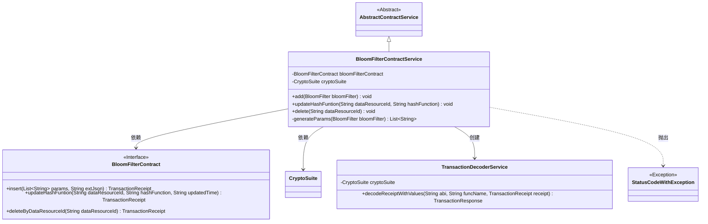
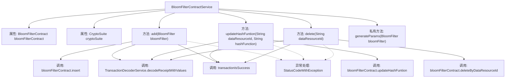

# 基础信息

|      |      |
|------|------|
| 名称 | BloomFilterContractService |
| 编码语言 | .java |
| 代码路径 | WeFe/union/union-service/src/main/java/com/welab/wefe/union/service/service/contract/BloomFilterContractService.java |
| 包名 | com.welab.wefe.union.service.service.contract |
| 依赖项 | ['com.welab.wefe.common.StatusCode', 'com.welab.wefe.common.data.mongodb.entity.union.BloomFilter', 'com.welab.wefe.common.exception.StatusCodeWithException', 'com.welab.wefe.common.util.DateUtil', 'com.welab.wefe.common.util.JObject', 'com.welab.wefe.common.util.StringUtil', 'com.welab.wefe.union.service.contract.BloomFilterContract', 'org.fisco.bcos.sdk.crypto.CryptoSuite', 'org.fisco.bcos.sdk.model.TransactionReceipt', 'org.fisco.bcos.sdk.transaction.codec.decode.TransactionDecoderService', 'org.fisco.bcos.sdk.transaction.model.dto.TransactionResponse', 'org.springframework.beans.factory.annotation.Autowired', 'org.springframework.stereotype.Service', 'java.util.ArrayList', 'java.util.Date', 'java.util.List'] |
| 概述说明 | BloomFilterContractService提供添加、更新和删除布隆过滤器的功能，通过智能合约操作并验证交易结果，异常时抛出错误。 |

# 说明

BloomFilterContractService是一个继承自AbstractContractService的服务类，用于管理布隆过滤器相关操作。它通过BloomFilterContract和CryptoSuite实现添加、更新和删除功能。添加操作将布隆过滤器参数和扩展JSON插入合约，更新操作修改指定数据资源的哈希函数和时间戳，删除操作根据数据资源ID移除记录。所有操作均通过交易回执解码验证结果，异常时抛出StatusCodeWithException。generateParams方法用于生成布隆过滤器的参数列表。

# 类列表 Class Summary

| 名称   | 类型  | 说明 |
|-------|------|-------------|
| BloomFilterContractService | class | BloomFilterContractService提供布隆过滤器操作，包括添加、更新哈希函数和删除功能，处理交易回执并检查结果，异常时抛出系统错误。 |

## 类 BloomFilterContractService

|      |      |
|------|------|
| 访问范围 | @Service;public |
| 类型 | class |
| 名称 | BloomFilterContractService |
| 说明 | BloomFilterContractService提供布隆过滤器操作，包括添加、更新哈希函数和删除功能，处理交易回执并检查结果，异常时抛出系统错误。 |

### UML类图

该类图展示了BloomFilterContractService继承自AbstractContractService，并依赖BloomFilterContract接口和CryptoSuite类。主要功能包括添加、更新和删除BloomFilter数据，通过调用智能合约方法并解码交易回执来验证操作结果。异常处理使用StatusCodeWithException，内部方法generateParams用于生成合约调用参数。TransactionDecoderService负责解码交易回执，与区块链交互的核心逻辑封装在服务类中。

### 内部方法调用关系图

流程图描述了BloomFilterContractService类的核心结构和调用关系。该类继承自AbstractContractService，包含两个自动注入属性和四个主要方法。add/update/delete三个公共方法均遵循相似流程：调用合约方法→解码交易回执→验证交易结果→异常处理。私有方法generateParams用于构造参数列表。所有公共方法都通过TransactionDecoderService解析交易结果，并统一调用transactionIsSuccess验证交易状态，异常时抛出StatusCodeWithException。

### 字段列表 Field List

| 名称  | 类型  | 说明 |
|-------|-------|------|
| bloomFilterContract | BloomFilterContract | 自动注入布隆过滤器合约实例。 |
| cryptoSuite | CryptoSuite | 自动注入加密工具组件实例。 |

### 方法列表

| 名称  | 类型  | 说明 |
|-------|-------|------|
| delete | void | 删除指定数据资源ID的BloomFilter信息，处理交易回执并检查结果，失败时抛出异常。 |
| updateHashFuntion | void | 更新哈希函数方法，传入数据资源ID和新哈希函数，记录更新时间并调用合约更新。解码交易回执验证成功，失败则抛出异常。 |
| add | void | 方法`add`将布隆过滤器数据插入合约，处理交易回执并检查结果，失败时抛出异常。 |
| generateParams | List<String> | 生成参数列表方法：接收布隆过滤器对象，提取数据资源ID、哈希函数、创建和更新时间，返回字符串列表。 |

