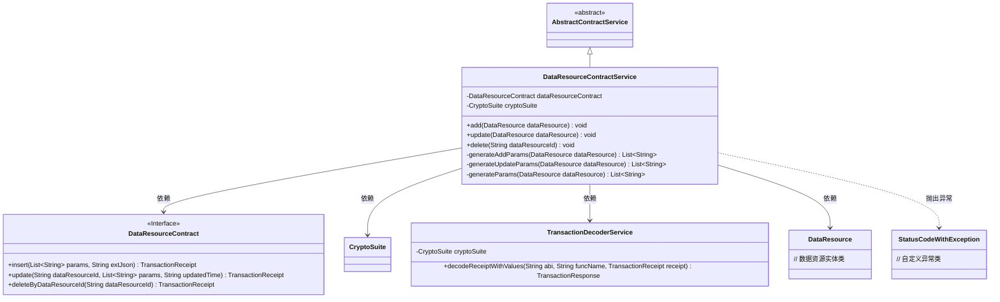
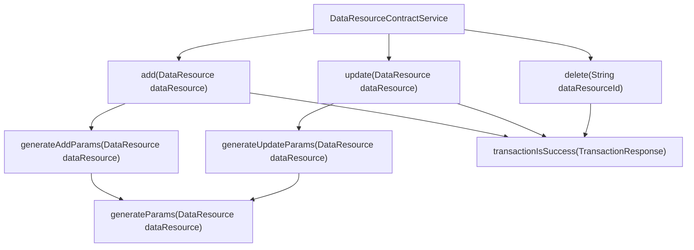
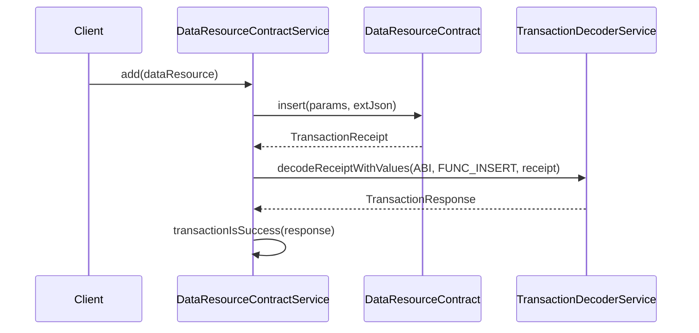

# 基础信息

|      |      |
|------|------|
| 名称 | DataResourceContractService |
| 编码语言 | .java |
| 代码路径 | WeFe/union/union-service/src/main/java/com/welab/wefe/union/service/service/contract/DataResourceContractService.java |
| 包名 | com.welab.wefe.union.service.service.contract |
| 依赖项 | ['com.welab.wefe.common.StatusCode', 'com.welab.wefe.common.data.mongodb.entity.union.DataResource', 'com.welab.wefe.common.exception.StatusCodeWithException', 'com.welab.wefe.common.util.DateUtil', 'com.welab.wefe.common.util.JObject', 'com.welab.wefe.common.util.StringUtil', 'com.welab.wefe.union.service.contract.DataResourceContract', 'org.fisco.bcos.sdk.crypto.CryptoSuite', 'org.fisco.bcos.sdk.model.TransactionReceipt', 'org.fisco.bcos.sdk.transaction.codec.decode.TransactionDecoderService', 'org.fisco.bcos.sdk.transaction.model.dto.TransactionResponse', 'org.springframework.beans.factory.annotation.Autowired', 'org.springframework.stereotype.Service', 'java.util.ArrayList', 'java.util.Date', 'java.util.List'] |
| 概述说明 | DataResourceContractService提供数据资源的增删改功能，通过智能合约操作并验证交易结果，处理异常情况。 |

# 说明

DataResourceContractService是一个继承自AbstractContractService的服务类，用于管理数据资源的增删改操作。它通过自动注入的DataResourceContract和CryptoSuite与区块链交互。add方法将DataResource对象转换为参数列表并调用合约的insert方法，处理交易回执并检查是否成功。update方法更新数据资源信息并记录更新时间。delete方法根据ID删除数据资源。私有方法generateAddParams和generateUpdateParams用于生成合约调用所需的参数列表，包含资源ID、成员ID、名称、描述等属性。所有操作均捕获异常并抛出StatusCodeWithException。

# 类列表 Class Summary

| 名称   | 类型  | 说明 |
|-------|------|-------------|
| DataResourceContractService | class | DataResourceContractService提供数据资源的增删改功能，通过区块链合约操作，处理事务回执并校验结果，异常时抛出系统错误。 |

## 类 DataResourceContractService

|      |      |
|------|------|
| 访问范围 | @Service;public |
| 类型 | class |
| 名称 | DataResourceContractService |
| 说明 | DataResourceContractService提供数据资源的增删改功能，通过区块链合约操作，处理事务回执并校验结果，异常时抛出系统错误。 |

### UML类图

这段代码描述了一个数据资源合约服务类(DataResourceContractService)，它继承自抽象合约服务类(AbstractContractService)，主要提供对数据资源的增删改操作。服务类通过注入的DataResourceContract接口与区块链合约交互，使用TransactionDecoderService解析交易回执，并处理可能出现的StatusCodeWithException异常。类图中清晰地展示了服务类与合约接口、加密套件、交易解码服务以及数据资源实体类之间的依赖关系，同时体现了继承结构和异常处理机制。

### 内部方法调用关系图

这段代码是DataResourceContractService类的实现，主要提供数据资源的增删改功能。通过流程图可以看到类中核心方法及其调用关系，时序图则展示了add方法的完整调用链。该类通过智能合约操作数据资源，包含参数生成、交易发送、回执解码和结果验证等关键步骤，采用异常统一处理机制确保操作可靠性。

### 字段列表 Field List

| 名称  | 类型  | 说明 |
|-------|-------|------|
| dataResourceContract | DataResourceContract | 自动注入DataResourceContract实例。 |
| cryptoSuite | CryptoSuite | 自动注入加密工具组件实例。 |

### 方法列表

| 名称  | 类型  | 说明 |
|-------|-------|------|
| update | void | 更新DataResource信息，处理交易回执并检查结果，失败时抛出异常。 |
| delete | void | 删除指定数据资源的方法，调用合约删除接口，处理交易回执并检查结果，异常时抛出系统错误。 |
| add | void | 该方法将数据资源添加到区块链，处理交易响应并检查成功状态，失败时抛出异常。 |
| generateAddParams | List<String> | 生成添加参数列表方法：将数据资源的ID、成员ID、类型、创建和更新时间等加入列表并返回。 |
| generateUpdateParams | List<String> | 生成更新参数列表，调用generateParams方法处理dataResource并返回结果。 |
| generateParams | List<String> | 生成参数列表方法，将数据资源对象的多个属性转为字符串列表，空值处理为空白。 |

