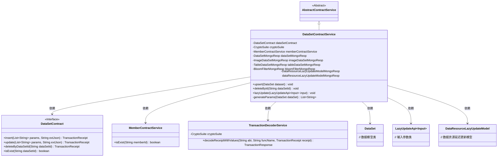
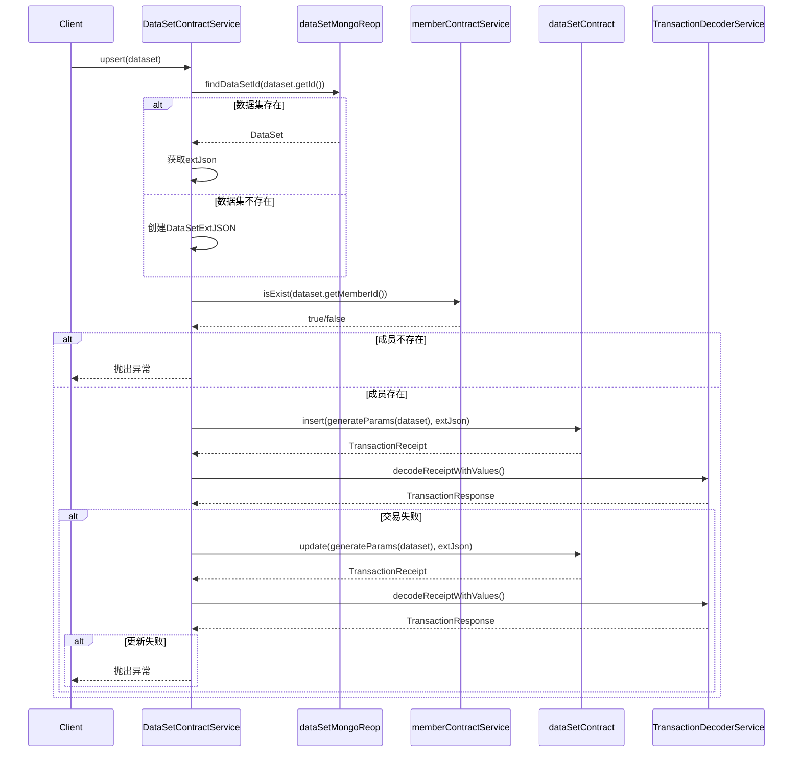

# 基础信息

|      |      |
|------|------|
| 名称 | DataSetContractService |
| 编码语言 | .java |
| 代码路径 | WeFe/union/union-service/src/main/java/com/welab/wefe/union/service/service/contract/DataSetContractService.java |
| 包名 | com.welab.wefe.union.service.service.contract |
| 依赖项 | ['com.alibaba.fastjson.JSON', 'com.welab.wefe.common.StatusCode', 'com.welab.wefe.common.data.mongodb.entity.base.AbstractMongoModel', 'com.welab.wefe.common.data.mongodb.entity.union.DataResourceLazyUpdateModel', 'com.welab.wefe.common.data.mongodb.entity.union.ext.DataSetExtJSON', 'com.welab.wefe.common.data.mongodb.repo', 'com.welab.wefe.common.exception.StatusCodeWithException', 'com.welab.wefe.common.util.DateUtil', 'com.welab.wefe.common.util.JObject', 'com.welab.wefe.common.util.StringUtil', 'com.welab.wefe.union.service.api.dataresource.LazyUpdateApi', 'com.welab.wefe.union.service.contract.DataSetContract', 'com.welab.wefe.union.service.entity.DataSet', 'org.fisco.bcos.sdk.crypto.CryptoSuite', 'org.fisco.bcos.sdk.model.TransactionReceipt', 'org.fisco.bcos.sdk.transaction.codec.decode.TransactionDecoderService', 'org.fisco.bcos.sdk.transaction.model.dto.TransactionResponse', 'org.springframework.beans.factory.annotation.Autowired', 'org.springframework.stereotype.Service', 'java.util.ArrayList', 'java.util.List'] |
| 概述说明 | 数据集服务类，提供增删改查功能，处理数据集插入、更新、删除及懒更新操作，依赖多个Mongo存储库和智能合约交互。 |

# 说明

DataSetContractService是一个继承自AbstractContractService的服务类，主要用于管理数据集的增删改查操作。它通过注入多个MongoDB仓库和智能合约服务，实现了数据集的上传、更新、删除及延迟更新功能。上传和更新操作会先检查成员是否存在，再通过智能合约处理，失败时抛出异常。删除操作会验证数据集存在性后再执行。延迟更新功能根据数据类型更新对应的统计信息到MongoDB。generateParams方法用于生成数据集参数列表。所有操作均包含异常处理和状态码返回。

# 类列表 Class Summary

| 名称   | 类型  | 说明 |
|-------|------|-------------|
| DataSetContractService | class | 数据集服务类，包含插入、更新、删除及延迟更新功能，处理数据集信息并验证成员存在性，支持多种数据资源类型操作。 |

## 类 DataSetContractService

|      |      |
|------|------|
| 访问范围 | @Service;public |
| 类型 | class |
| 名称 | DataSetContractService |
| 说明 | 数据集服务类，包含插入、更新、删除及延迟更新功能，处理数据集信息并验证成员存在性，支持多种数据资源类型操作。 |

### UML类图

这段代码展示了一个数据集合约服务(DataSetContractService)，它继承自抽象合约服务(AbstractContractService)，主要功能包括数据集的增删改查操作。服务通过依赖注入获取多个MongoDB存储库和智能合约接口，核心方法upsert()实现了数据集的插入或更新逻辑，deleteById()处理删除操作，lazyUpdate()实现延迟更新功能。类图中清晰地展示了服务与各种依赖组件之间的关系，包括合约接口、成员服务、事务解码器以及各类数据模型。

### 内部方法调用关系图

```mermaid
graph TD
    A["类DataSetContractService"]
    B["属性: DataSetContract dataSetContract"]
    C["属性: CryptoSuite cryptoSuite"]
    D["属性: MemberContractService memberContractService"]
    E["属性: DataSetMongoReop dataSetMongoReop"]
    F["属性: ImageDataSetMongoReop imageDataSetMongoReop"]
    G["属性: TableDataSetMongoReop tableDataSetMongoReop"]
    H["属性: BloomFilterMongoReop bloomFilterMongoReop"]
    I["属性: DataResourceLazyUpdateModelMongoReop dataResourceLazyUpdateModelMongoReop"]
    J["方法: upsert(DataSet dataset)"]
    K["方法: deleteById(String dataSetId)"]
    L["方法: lazyUpdate(LazyUpdateApi.Input input)"]
    M["私有方法: generateParams(DataSet dataSet)"]

    A --> B
    A --> C
    A --> D
    A --> E
    A --> F
    A --> G
    A --> H
    A --> I
    A --> J
    A --> K
    A --> L
    A --> M
```

这段代码是DataSetContractService类的实现，主要用于处理数据集的增删改查操作。类中包含了多个自动注入的依赖项，如数据集合约、加密套件、成员合约服务等。核心方法upsert实现了数据集的插入或更新逻辑，首先检查数据集是否存在，然后验证成员有效性，最后通过区块链合约执行操作。deleteById方法用于删除指定ID的数据集，lazyUpdate方法处理数据资源的延迟更新。generateParams私有方法用于生成数据集操作所需的参数列表。整个流程涉及数据库查询、区块链交易和异常处理，体现了复杂业务逻辑的完整处理链条。

### 字段列表 Field List

| 名称  | 类型  | 说明 |
|-------|-------|------|
| bloomFilterMongoReop | BloomFilterMongoReop | 使用@Autowired自动注入BloomFilterMongoReop仓库实例。 |
| dataSetContract | DataSetContract | 自动注入DataSetContract实例。 |
| imageDataSetMongoReop | ImageDataSetMongoReop | 使用@Autowired自动注入ImageDataSetMongoReop仓库实例。 |
| dataSetMongoReop | DataSetMongoReop | 使用@Autowired自动注入DataSetMongoReop仓库实例。 |
| tableDataSetMongoReop | TableDataSetMongoReop | 使用@Autowired自动注入TableDataSetMongoReop的MongoDB仓库实例。 |
| memberContractService | MemberContractService | 代码片段使用@Autowired注解自动注入MemberContractService实例。 |
| dataResourceLazyUpdateModelMongoReop | DataResourceLazyUpdateModelMongoReop | 使用@Autowired自动注入DataResourceLazyUpdateModelMongoReop仓库实例。 |
| cryptoSuite | CryptoSuite | 使用@Autowired自动注入CryptoSuite加密工具组件。 |

### 方法列表

| 名称  | 类型  | 说明 |
|-------|-------|------|
| upsert | void | 方法upsert用于插入或更新数据集。检查成员ID是否存在，不存在则报错。若数据集存在则获取其扩展JSON，否则创建新的。尝试插入数据，失败则更新。操作失败抛出异常。 |
| deleteById | void | 该方法根据ID删除数据集，检查存在性后调用合约删除，处理交易回执并验证结果，失败时抛出异常。 |
| lazyUpdate | void | 懒更新方法根据输入类型查询对应数据源，验证后创建或更新懒更新模型，设置各项统计信息并保存。 |
| generateParams | List<String> | 该方法将DataSet对象的属性转换为字符串列表，包括ID、成员ID、名称、行列数、特征数、公开级别、使用次数、描述、标签及创建更新时间等。 |

