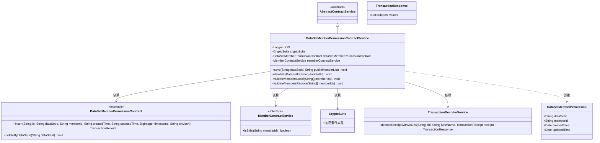
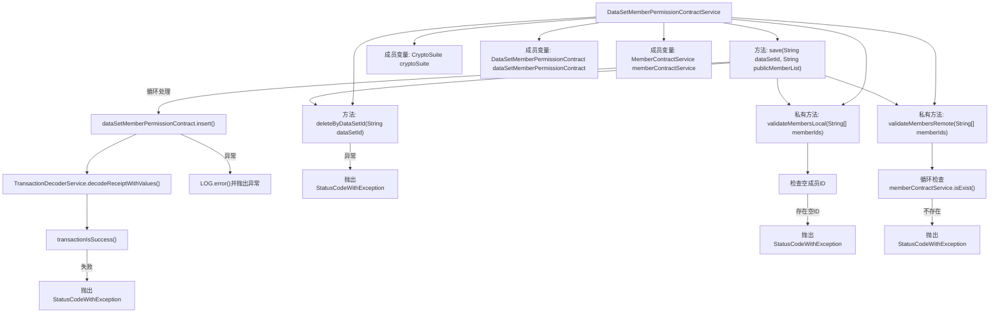

# 基础信息

|      |      |
|------|------|
| 名称 | DataSetMemberPermissionContractService |
| 编码语言 | .java |
| 代码路径 | WeFe/union/union-service/src/main/java/com/welab/wefe/union/service/service/contract/DataSetMemberPermissionContractService.java |
| 包名 | com.welab.wefe.union.service.service.contract |
| 依赖项 | ['com.welab.wefe.common.StatusCode', 'com.welab.wefe.common.exception.StatusCodeWithException', 'com.welab.wefe.common.util.DateUtil', 'com.welab.wefe.union.service.contract.DataSetMemberPermissionContract', 'com.welab.wefe.union.service.entity.DataSetMemberPermission', 'org.fisco.bcos.sdk.crypto.CryptoSuite', 'org.fisco.bcos.sdk.model.TransactionReceipt', 'org.fisco.bcos.sdk.transaction.codec.decode.TransactionDecoderService', 'org.fisco.bcos.sdk.transaction.model.dto.TransactionResponse', 'org.slf4j.Logger', 'org.slf4j.LoggerFactory', 'org.springframework.beans.factory.annotation.Autowired', 'org.springframework.stereotype.Service', 'java.math.BigInteger', 'java.util.Arrays', 'java.util.List', 'java.util.stream.Collectors'] |
| 概述说明 | 数据集成员权限服务类，提供保存和删除权限功能。保存时验证成员ID有效性，删除旧权限后插入新权限。异常时抛出状态码错误。 |

# 说明

DataSetMemberPermissionContractService是一个继承自AbstractContractService的服务类，主要用于管理数据集成员权限。它通过自动注入的组件处理权限保存和删除操作。save方法接收数据集ID和成员列表，先验证成员ID的本地和远程有效性，然后删除旧权限并插入新权限记录。插入时生成交易收据并检查执行状态，失败时抛出异常。deleteByDataSetId方法根据数据集ID删除权限记录。本地验证检查空成员ID，远程验证确保成员存在。异常处理包括日志记录和状态码返回。

# 类列表 Class Summary

| 名称   | 类型  | 说明 |
|-------|------|-------------|
| DataSetMemberPermissionContractService | class | DataSetMemberPermissionContractService类用于管理数据集成员权限，包含保存和删除权限功能。保存时验证成员ID有效性，删除旧权限后插入新权限。异常处理包括参数校验和系统错误。 |

## 类 DataSetMemberPermissionContractService

|      |      |
|------|------|
| 访问范围 | @Service;public |
| 类型 | class |
| 名称 | DataSetMemberPermissionContractService |
| 说明 | DataSetMemberPermissionContractService类用于管理数据集成员权限，包含保存和删除权限功能。保存时验证成员ID有效性，删除旧权限后插入新权限。异常处理包括参数校验和系统错误。 |

### UML类图

该代码实现了一个数据集成员权限管理服务，主要功能包括保存权限和按数据集ID删除权限。服务通过本地校验（空ID检测）和远程校验（成员存在性检查）确保数据有效性，使用区块链智能合约进行持久化操作。类图展示了服务与加密组件、合约接口、成员服务及事务解码器的协作关系，体现了分层设计和接口隔离原则。核心业务流程涉及权限对象创建、区块链交易提交和回执解析。

### 内部方法调用关系图

这段代码是数据集成员权限合约服务类，主要处理成员权限的保存和删除操作。流程图展示了类结构和核心方法调用链：save方法先验证成员ID有效性，删除旧权限后循环插入新权限记录；delete方法直接删除指定数据集权限；两个验证方法分别检查本地格式和远程成员是否存在。关键操作涉及区块链交易处理和异常状态码返回。

### 字段列表 Field List

| 名称  | 类型  | 说明 |
|-------|-------|------|
| memberContractService | MemberContractService | 代码片段使用@Autowired自动注入MemberContractService服务实例。 |
| cryptoSuite | CryptoSuite | 自动注入加密工具组件。 |
| dataSetMemberPermissionContract | DataSetMemberPermissionContract | 自动注入数据集成员权限合约实例。 |
| LOG = LoggerFactory.getLogger(DataSetMemberPermissionContractService.class) | Logger | 定义日志记录器LOG，用于DataSetMemberPermissionContractService类的日志输出。 |

### 方法列表

| 名称  | 类型  | 说明 |
|-------|-------|------|
| save | void | 方法save用于保存数据集权限：验证本地和远程成员ID，删除旧权限后，逐个插入新权限到区块链合约，处理交易结果和异常。 |
| deleteByDataSetId | void | 该方法根据数据集ID删除相关权限，若失败则抛出系统错误异常。 |
| validateMembersLocal | void | 该方法验证成员ID数组是否包含空字符串。若发现空ID，抛出参数无效异常并提示"包含空成员ID"。 |
| validateMembersRemote | void | 验证远程成员ID有效性，若任一ID不存在则抛出参数无效异常。 |

