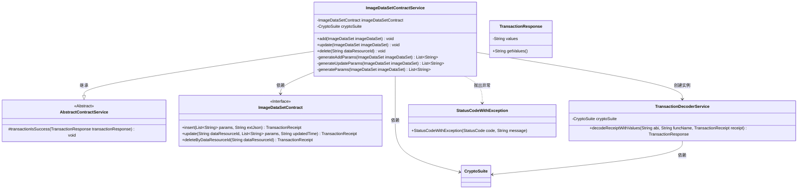
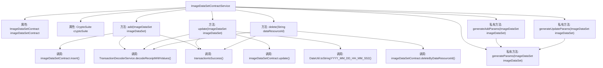

# 基础信息

|      |      |
|------|------|
| 名称 | ImageDataSetContractService |
| 编码语言 | .java |
| 代码路径 | WeFe/union/union-service/src/main/java/com/welab/wefe/union/service/service/contract/ImageDataSetContractService.java |
| 包名 | com.welab.wefe.union.service.service.contract |
| 依赖项 | ['com.welab.wefe.common.StatusCode', 'com.welab.wefe.common.data.mongodb.entity.union.ImageDataSet', 'com.welab.wefe.common.exception.StatusCodeWithException', 'com.welab.wefe.common.util.DateUtil', 'com.welab.wefe.common.util.JObject', 'com.welab.wefe.common.util.StringUtil', 'com.welab.wefe.union.service.contract.ImageDataSetContract', 'org.fisco.bcos.sdk.crypto.CryptoSuite', 'org.fisco.bcos.sdk.model.TransactionReceipt', 'org.fisco.bcos.sdk.transaction.codec.decode.TransactionDecoderService', 'org.fisco.bcos.sdk.transaction.model.dto.TransactionResponse', 'org.springframework.beans.factory.annotation.Autowired', 'org.springframework.stereotype.Service', 'java.util.ArrayList', 'java.util.Date', 'java.util.List'] |
| 概述说明 | ImageDataSetContractService提供图片数据集增删改功能，通过智能合约操作数据，处理交易回执并校验结果，异常时抛出错误。 |

# 说明

ImageDataSetContractService是一个继承自AbstractContractService的服务类，用于管理图像数据集合约操作。它通过自动装配ImageDataSetContract和CryptoSuite实现区块链交互。主要功能包括添加、更新和删除图像数据集。添加操作通过generateAddParams生成参数并调用合约插入方法，更新操作使用generateUpdateParams生成参数并记录更新时间，删除操作根据dataResourceId执行。所有操作均通过TransactionDecoderService解析交易回执并验证成功状态，异常时抛出StatusCodeWithException。参数生成方法处理数据集的各类属性，确保非空值转换为空字符串。

# 类列表 Class Summary

| 名称   | 类型  | 说明 |
|-------|------|-------------|
| ImageDataSetContractService | class | ImageDataSetContractService提供图像数据集的增删改功能，通过智能合约操作数据，处理交易回执并验证结果，异常时抛出错误。 |

## 类 ImageDataSetContractService

|      |      |
|------|------|
| 访问范围 | @Service;public |
| 类型 | class |
| 名称 | ImageDataSetContractService |
| 说明 | ImageDataSetContractService提供图像数据集的增删改功能，通过智能合约操作数据，处理交易回执并验证结果，异常时抛出错误。 |

### UML类图

这段代码展示了一个图像数据集合约服务类，它继承自抽象合约服务类，并实现了对图像数据集的增删改操作。主要功能包括通过智能合约插入、更新和删除图像数据集，处理交易回执并验证交易结果。类图中清晰地展示了类之间的继承、依赖和关联关系，包括与底层区块链交互的合约接口、交易解码服务以及异常处理机制。该服务通过封装区块链操作细节，为上层提供简洁的数据集管理接口。

### 内部方法调用关系图

该流程图展示了ImageDataSetContractService类的结构和主要方法调用关系。类包含三个核心方法(add/update/delete)和三个参数生成方法，均围绕ImageDataSetContract智能合约操作。每个核心方法都遵循相似流程：调用合约方法→解码交易回执→验证交易结果，异常时抛出StatusCodeWithException。私有方法generateParams被其他参数生成方法复用，体现了代码复用性。

### 字段列表 Field List

| 名称  | 类型  | 说明 |
|-------|-------|------|
| imageDataSetContract | ImageDataSetContract | 使用@Autowired自动注入ImageDataSetContract实例。 |
| cryptoSuite | CryptoSuite | 自动注入加密工具组件实例。 |

### 方法列表

| 名称  | 类型  | 说明 |
|-------|-------|------|
| generateAddParams | List<String> | 生成添加参数列表方法：将数据资源ID、生成参数、创建和更新时间加入列表并返回。 |
| generateUpdateParams | List<String> | 生成更新参数列表，调用通用参数生成方法处理图像数据集。 |
| delete | void | 该方法通过区块链智能合约删除指定数据资源ID的记录，处理交易回执并检查执行结果，失败时抛出系统错误异常。 |
| add | void | 该方法用于添加图像数据集，调用合约插入数据并处理交易回执，成功则返回响应值，失败抛出异常提示系统错误。 |
| update | void | 更新ImageDataSet数据，生成参数并调用合约更新，处理交易回执，失败时抛出异常。 |
| generateParams | List<String> | 该方法生成参数列表，包含图像数据集的作业类型、标签列表、已标注数量、标注完成状态和文件大小，空值转为空字符串。 |

