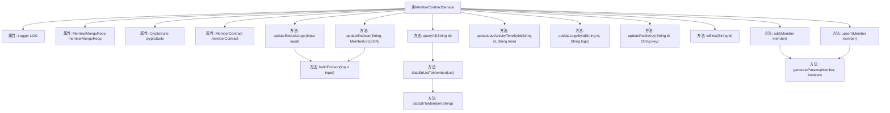

# 基础信息

|      |      |
|------|------|
| 名称 | MemberContractService |
| 编码语言 | .java |
| 代码路径 | WeFe/union/union-service/src/main/java/com/welab/wefe/union/service/service/contract/MemberContractService.java |
| 包名 | com.welab.wefe.union.service.service.contract |
| 依赖项 | ['com.welab.wefe.common.StatusCode', 'com.welab.wefe.common.data.mongodb.entity.union.ext.MemberExtJSON', 'com.welab.wefe.common.data.mongodb.repo.MemberMongoReop', 'com.welab.wefe.common.exception.StatusCodeWithException', 'com.welab.wefe.common.util.DateUtil', 'com.welab.wefe.common.util.JObject', 'com.welab.wefe.common.util.StringUtil', 'com.welab.wefe.union.service.api.member.UpdateExcludeLogoApi', 'com.welab.wefe.union.service.contract.MemberContract', 'com.welab.wefe.union.service.entity.Member', 'org.apache.commons.collections4.CollectionUtils', 'org.fisco.bcos.sdk.abi.datatypes.generated.tuples.generated.Tuple2', 'org.fisco.bcos.sdk.crypto.CryptoSuite', 'org.fisco.bcos.sdk.model.TransactionReceipt', 'org.fisco.bcos.sdk.transaction.codec.decode.TransactionDecoderService', 'org.fisco.bcos.sdk.transaction.model.dto.TransactionResponse', 'org.slf4j.Logger', 'org.slf4j.LoggerFactory', 'org.springframework.beans.factory.annotation.Autowired', 'org.springframework.stereotype.Service', 'java.lang.reflect.Field', 'java.math.BigInteger', 'java.util.ArrayList', 'java.util.Date', 'java.util.List'] |
| 概述说明 | MemberContractService提供成员管理功能，包括添加、更新、查询成员信息，处理区块链交易并校验结果。支持更新成员logo、公钥、活动时间等属性，通过事务确保数据一致性。 |

# 说明

MemberContractService是一个基于区块链的成员管理服务类，继承自AbstractContractService。它通过成员合约与区块链交互，提供成员信息的增删改查功能。主要功能包括：添加成员(add)、更新成员信息(upsert)、更新成员信息但不包含logo(updateExcludeLogo)、更新成员最后活动时间(updateLastActivityTimeById)、更新成员logo(updateLogoById)、更新成员公钥(updatePublicKey)、检查成员是否存在(isExist)、查询所有成员(queryAll)。服务类使用MongoDB存储成员扩展信息，并通过TransactionDecoderService解析区块链交易回执，处理各种异常情况如数据已存在、数据不存在等。成员信息通过管道符分隔的字符串与Member对象相互转换。

# 类列表 Class Summary

| 名称   | 类型  | 说明 |
|-------|------|-------------|
| MemberContractService | class | MemberContractService提供成员管理功能，包括添加、更新、查询成员信息，处理区块链交易，并记录日志。 |


## 类 MemberContractService

|      |      |
|------|------|
| 访问范围 | @Service;public |
| 类型 | class |
| 名称 | MemberContractService |
| 说明 | MemberContractService提供成员管理功能，包括添加、更新、查询成员信息，处理区块链交易，并记录日志。 |


### UML类图

```mermaid
classDiagram
    class AbstractContractService {
        <<abstract>>
    }

    class MemberContractService {
        -Logger LOG
        -MemberMongoReop memberMongoReop
        -CryptoSuite cryptoSuite
        -MemberContract memberContract
        +add(Member member) void
        +upsert(Member member) void
        +updateExcludeLogo(UpdateExcludeLogoApi.Input input) void
        +buildExtJson(UpdateExcludeLogoApi.Input input) JObject
        +updateLastActivityTimeById(String id, String lastActivityTime) void
        +updateLogoById(String id, String logo) void
        +updatePublicKey(String id, String publicKey) void
        +isExist(String id) boolean
        +queryAll(String id) List~Member~
        -dataStrListToMember(List~String~ dataStrList) List~Member~
        -dataStrToMember(String dataStr) Member
        -generateParams(Member member, boolean isContainPublicKey) List~String~
        +updateExtJson(String memberId, MemberExtJSON extJSON) void
    }

    class Member {
        +String id
        +String name
        +String mobile
        +int allowOpenDataSet
        +int hidden
        +int freezed
        +int lostContact
        +String logo
        +String publicKey
        +String email
        +String gatewayUri
        +Date createdTime
        +Date updatedTime
        +long lastActivityTime
        +long logTime
        +String extJson
    }

    class MemberContract {
        <<Interface>>
        +insert(List~String~ params, String extJson) TransactionReceipt
        +updateExcludePublicKey(List~String~ params, String extJson) TransactionReceipt
        +updateExcludeLogo(List~String~ params, String extJson) TransactionReceipt
        +updateLastActivityTimeById(String id, String lastActivityTime) TransactionReceipt
        +updateLogoById(String id, String logo) TransactionReceipt
        +updatePublicKey(String id, String publicKey) TransactionReceipt
        +isExist(String id) Boolean
        +selectById(String id) Tuple2~BigInteger, List~String~~
        +count(String id, String name, String mobile, String email, String gatewayUri) BigInteger
        +selectByPage(String id, String name, String mobile, String email, String gatewayUri, BigInteger offset, BigInteger limit) Tuple2~BigInteger, List~String~~
        +updateExtJson(String memberId, String extJson) TransactionReceipt
    }

    class TransactionDecoderService {
        -CryptoSuite cryptoSuite
        +decodeReceiptWithValues(String abi, String functionName, TransactionReceipt receipt) TransactionResponse
    }

    class TransactionResponse {
        +String values
        +String returnMessage
        +getValues() String
        +getReturnMessage() String
    }

    class MemberExtJSON {
        +String secretKeyType
        +Boolean memberGatewayTlsEnable
    }

    class UpdateExcludeLogoApi$Input {
        +String id
        +String name
        +String mobile
        +Boolean allowOpenDataSet
        +Boolean hidden
        +Boolean freezed
        +Boolean lostContact
        +String publicKey
        +String email
        +String gatewayUri
        +String curMemberId
    }

    AbstractContractService <|-- MemberContractService
    MemberContractService --> MemberContract : 依赖
    MemberContractService --> MemberMongoReop : 依赖
    MemberContractService --> CryptoSuite : 依赖
    MemberContractService --> TransactionDecoderService : 依赖
    MemberContractService --> Member : 依赖
    MemberContractService --> MemberExtJSON : 依赖
    MemberContractService --> UpdateExcludeLogoApi$Input : 依赖
    TransactionDecoderService --> CryptoSuite : 依赖
    TransactionDecoderService --> TransactionResponse : 依赖
```

这段类图展示了MemberContractService及其相关类的结构。MemberContractService继承自AbstractContractService，依赖多个组件如MemberContract、MemberMongoReop和CryptoSuite，提供了成员管理的核心功能，包括添加、更新、查询成员信息等操作。Member类表示成员实体，MemberContract是智能合约接口，TransactionDecoderService用于解码交易响应。整体设计体现了区块链应用的分层架构，服务层处理业务逻辑，合约层与区块链交互。


### 内部方法调用关系图



该流程图展示了MemberContractService类的完整结构，包含4个自动注入属性和12个核心方法。主要功能分为成员数据操作（add/upsert/update系列）、查询方法（isExist/queryAll）和工具方法（generateParams/dataStrToMember等）。所有区块链操作都遵循"发送交易→解码回执→校验结果"的标准流程，异常处理通过StatusCodeWithException统一管理。关键方法如updateExcludeLogo会调用buildExtJson构建扩展参数，数据转换通过dataStrToMember实现字符串到对象的映射。

### 字段列表 Field List

| 名称  | 类型  | 说明 |
|-------|-------|------|
| memberMongoReop | MemberMongoReop | 自动注入MemberMongoReop成员变量 |
| memberContract | MemberContract | 自动注入MemberContract成员变量。 |
| cryptoSuite | CryptoSuite | 使用@Autowired自动注入CryptoSuite加密工具组件。 |
| LOG = LoggerFactory.getLogger(MemberContractService.class) | Logger | 定义私有静态常量LOG，使用LoggerFactory获取MemberContractService类的日志记录器实例。 |

### 方法列表

| 名称  | 类型  | 说明 |
|-------|-------|------|
| buildExtJson | JObject | 构建扩展JSON对象，设置密钥类型和网关TLS启用状态，遍历字段更新JSON值，返回结果。 |
| updateLastActivityTimeById | void | 该方法通过区块链更新成员最后活动时间，处理交易响应并检查异常，失败时抛出状态码异常。 |
| upsert | void | 该方法用于更新或插入成员信息。发送交易并处理返回结果，若交易异常或数据不存在则抛出错误。捕获异常时记录日志并抛出系统错误。 |
| queryAll | List<Member> | 查询成员信息方法：根据ID查询单个成员或分页查询所有成员，无数据返回空列表，异常时抛出系统错误。 |
| dataStrListToMember | List<Member> | 将字符串列表转换为成员对象列表，若输入为空则返回空列表。遍历每个字符串并调用转换方法，最终返回成员列表。 |
| isExist | boolean | 检查成员信息是否存在：调用memberContract.isExist(id)，返回结果非空且为true则存在；异常时记录日志并抛出系统错误状态。 |
| updatePublicKey | void | 更新成员公钥方法，发送交易并处理响应，失败时抛出异常。 |
| updateLogoById | void | 方法updateLogoById通过区块链更新成员logo。发送交易并解码响应，处理成功或异常情况，如系统繁忙或数据不存在。异常时抛出对应错误。 |
| updateExcludeLogo | void | 该方法用于更新成员合约的排除标志，处理输入参数并构建交易请求，执行区块链交易并处理响应结果，捕获异常并记录日志。 |
| add | void | 该方法用于添加成员到区块链合约。发送交易并处理返回结果，检查交易异常、成员是否存在及插入失败情况，抛出相应异常。捕获并记录错误信息。 |
| dataStrToMember | Member | 将字符串解析为Member对象，处理ID、姓名、手机等字段，包含状态、时间及扩展信息。空字符串返回null。 |
| generateParams | List<String> | 生成参数列表方法，包含成员ID、姓名、手机号等基本信息及状态标志，可选公钥，添加时间戳和格式化日期。 |
| updateExtJson | void | 更新会员扩展JSON数据：通过反射获取字段值，转换为下划线格式后存入JSON对象，调用合约更新并检查交易结果，异常时抛出系统错误。 |


