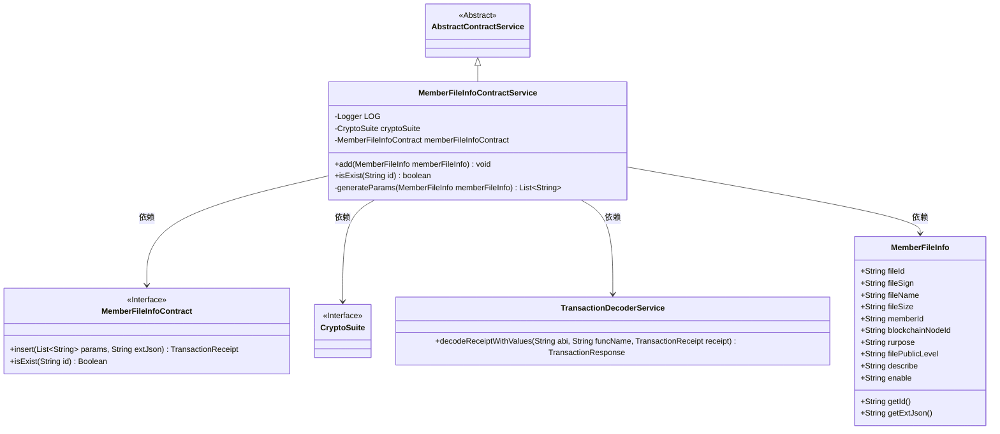
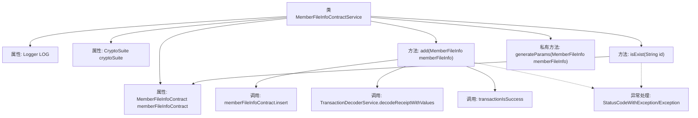
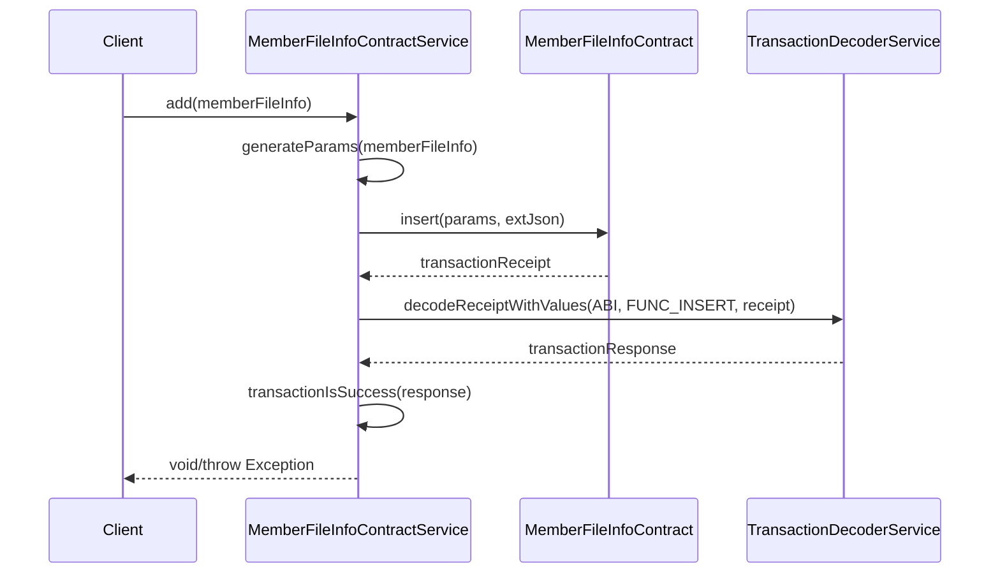

# 基础信息

|      |      |
|------|------|
| 名称 | MemberFileInfoContractService |
| 编码语言 | .java |
| 代码路径 | WeFe/union/union-service/src/main/java/com/welab/wefe/union/service/service/contract/MemberFileInfoContractService.java |
| 包名 | com.welab.wefe.union.service.service.contract |
| 依赖项 | ['com.welab.wefe.common.StatusCode', 'com.welab.wefe.common.data.mongodb.entity.union.MemberFileInfo', 'com.welab.wefe.common.exception.StatusCodeWithException', 'com.welab.wefe.common.util.DateUtil', 'com.welab.wefe.common.util.JObject', 'com.welab.wefe.common.util.StringUtil', 'com.welab.wefe.union.service.contract.MemberFileInfoContract', 'org.fisco.bcos.sdk.crypto.CryptoSuite', 'org.fisco.bcos.sdk.model.TransactionReceipt', 'org.fisco.bcos.sdk.transaction.codec.decode.TransactionDecoderService', 'org.fisco.bcos.sdk.transaction.model.dto.TransactionResponse', 'org.slf4j.Logger', 'org.slf4j.LoggerFactory', 'org.springframework.beans.factory.annotation.Autowired', 'org.springframework.stereotype.Service', 'java.util.ArrayList', 'java.util.Date', 'java.util.List'] |
| 概述说明 | MemberFileInfoContractService类提供成员文件信息操作，包括添加文件和检查文件是否存在。添加文件时生成参数并发送交易，检查存在性通过合约查询实现。异常处理记录日志并抛出状态码异常。 |

# 说明

该代码定义了一个名为MemberFileInfoContractService的服务类，继承自AbstractContractService。主要功能包括添加成员文件信息和检查文件是否存在。添加功能通过调用memberFileInfoContract的insert方法发送交易，并处理交易回执。检查存在性通过调用isExist方法实现。类中使用了CryptoSuite和MemberFileInfoContract的自动注入，并包含日志记录和异常处理。generateParams方法用于生成成员文件信息的参数列表。

# 类列表 Class Summary

| 名称   | 类型  | 说明 |
|-------|------|-------------|
| MemberFileInfoContractService | class | MemberFileInfoContractService类提供成员文件信息操作，包括添加文件和检查文件是否存在。添加文件时生成参数并处理交易响应，检查存在性则返回布尔值。异常处理记录日志并抛出。 |

## 类 MemberFileInfoContractService

|      |      |
|------|------|
| 访问范围 | @Service;public |
| 类型 | class |
| 名称 | MemberFileInfoContractService |
| 说明 | MemberFileInfoContractService类提供成员文件信息操作，包括添加文件和检查文件是否存在。添加文件时生成参数并处理交易响应，检查存在性则返回布尔值。异常处理记录日志并抛出。 |

### UML类图

类图描述：该图展示了MemberFileInfoContractService继承自AbstractContractService，并依赖MemberFileInfoContract接口、CryptoSuite接口、TransactionDecoderService类以及MemberFileInfo类。服务类提供添加成员文件信息和检查存在性的方法，其中包含私有方法生成参数列表。各组件通过清晰的依赖关系协作完成区块链交易处理功能。

### 内部方法调用关系图

该流程图展示了MemberFileInfoContractService类的核心结构和调用关系，包含三个主要方法：添加成员文件信息(add)、检查是否存在(isExist)和生成参数列表(generateParams)。时序图详细描述了add方法的执行流程，包括参数生成、合约调用、交易解码和结果验证等步骤，同时标注了异常处理路径。类通过自动装配的cryptoSuite和memberFileInfoContract完成区块链相关操作，所有方法都包含完善的错误处理和日志记录机制。

### 字段列表 Field List

| 名称  | 类型  | 说明 |
|-------|-------|------|
| memberFileInfoContract | MemberFileInfoContract | 使用@Autowired自动注入MemberFileInfoContract成员变量。 |
| cryptoSuite | CryptoSuite | 代码片段声明了一个私有字段cryptoSuite，使用@Autowired注解实现自动依赖注入。 |
| LOG = LoggerFactory.getLogger(MemberFileInfoContractService.class) | Logger | 类MemberFileInfoContractService中定义了一个静态不可变的日志记录器LOG。 |

### 方法列表

| 名称  | 类型  | 说明 |
|-------|-------|------|
| isExist | boolean | 检查成员文件信息是否存在。成功返回布尔值，失败记录错误并抛出系统异常。 |
| add | void | 方法add用于添加成员文件信息，调用合约插入数据并处理交易结果，成功记录日志，异常时抛出错误。 |
| generateParams | List<String> | 生成参数列表方法，包含文件ID、签名、名称、大小、成员ID、节点ID、用途、公开级别、描述、启用状态及两个时间戳。 |

