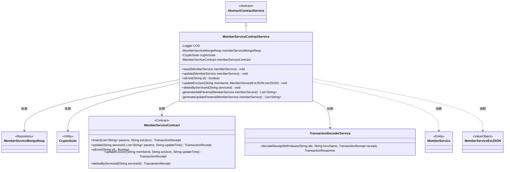
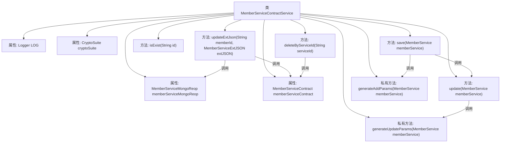

# 基础信息

|      |      |
|------|------|
| 名称 | MemberServiceContractService |
| 编码语言 | .java |
| 代码路径 | WeFe/union/union-service/src/main/java/com/welab/wefe/union/service/service/contract/MemberServiceContractService.java |
| 包名 | com.welab.wefe.union.service.service.contract |
| 依赖项 | ['com.welab.wefe.common.StatusCode', 'com.welab.wefe.common.data.mongodb.entity.union.MemberService', 'com.welab.wefe.common.data.mongodb.entity.union.ext.MemberServiceExtJSON', 'com.welab.wefe.common.data.mongodb.repo.MemberServiceMongoReop', 'com.welab.wefe.common.exception.StatusCodeWithException', 'com.welab.wefe.common.util.DateUtil', 'com.welab.wefe.common.util.JObject', 'com.welab.wefe.common.util.StringUtil', 'com.welab.wefe.union.service.contract.MemberServiceContract', 'org.fisco.bcos.sdk.crypto.CryptoSuite', 'org.fisco.bcos.sdk.model.TransactionReceipt', 'org.fisco.bcos.sdk.transaction.codec.decode.TransactionDecoderService', 'org.fisco.bcos.sdk.transaction.model.dto.TransactionResponse', 'org.slf4j.Logger', 'org.slf4j.LoggerFactory', 'org.springframework.beans.factory.annotation.Autowired', 'org.springframework.stereotype.Service', 'java.lang.reflect.Field', 'java.util.ArrayList', 'java.util.Date', 'java.util.List'] |
| 概述说明 | MemberServiceContractService类提供会员服务的增删改查功能，包括保存、更新、检查存在性、更新扩展JSON和删除操作，处理交易响应并记录日志。 |

# 说明

MemberServiceContractService是一个继承自AbstractContractService的服务类，主要用于管理会员服务的增删改查操作。它通过MemberServiceContract与区块链交互，使用TransactionDecoderService解析交易回执。主要功能包括保存会员服务（save）、更新会员服务（update）、检查服务是否存在（isExist）、更新扩展JSON（updateExtJson）和删除服务（deleteByServiceId）。保存和更新操作会生成相应的参数列表，并处理交易响应。所有操作都包含异常处理和日志记录，确保系统稳定性和可追溯性。

# 类列表 Class Summary

| 名称   | 类型  | 说明 |
|-------|------|-------------|
| MemberServiceContractService | class | MemberServiceContractService类提供会员服务合约操作，包括保存、更新、查询存在性、更新扩展JSON和删除功能，处理交易响应并记录日志。 |

## 类 MemberServiceContractService

|      |      |
|------|------|
| 访问范围 | @Service;public |
| 类型 | class |
| 名称 | MemberServiceContractService |
| 说明 | MemberServiceContractService类提供会员服务合约操作，包括保存、更新、查询存在性、更新扩展JSON和删除功能，处理交易响应并记录日志。 |

### UML类图

这段代码展示了一个会员服务合约服务类`MemberServiceContractService`，它继承自抽象类`AbstractContractService`，并依赖多个组件如`MemberServiceMongoReop`、`CryptoSuite`和`MemberServiceContract`来实现会员服务的增删改查功能。该类通过调用智能合约方法处理交易，并使用`TransactionDecoderService`解析交易回执，同时包含生成参数列表的私有方法。整体设计体现了分层架构，将业务逻辑与数据访问、合约交互分离。

### 内部方法调用关系图

这段代码展示了一个会员服务合约服务类，主要处理会员服务的增删改查操作。类中包含保存、更新、检查存在性、更新扩展JSON和删除服务等方法，以及生成添加和更新参数的私有方法。核心流程涉及区块链交易处理，包括交易发送、收据解码和结果验证，同时集成了MongoDB存储和加密套件功能。异常处理机制完善，通过日志记录关键操作信息。

### 字段列表 Field List

| 名称  | 类型  | 说明 |
|-------|-------|------|
| memberServiceContract | MemberServiceContract | 自动注入MemberServiceContract成员服务合约实例。 |
| cryptoSuite | CryptoSuite | 代码片段声明了一个私有成员变量cryptoSuite，使用@Autowired注解实现自动依赖注入。 |
| memberServiceMongoReop | MemberServiceMongoReop | 使用@Autowired自动注入MemberServiceMongoReop实例。 |
| LOG = LoggerFactory.getLogger(MemberServiceContractService.class) | Logger | 类MemberServiceContractService中定义了一个静态不可变日志对象LOG。 |

### 方法列表

| 名称  | 类型  | 说明 |
|-------|-------|------|
| updateExtJson | void | 方法updateExtJson更新会员扩展JSON数据：查询现有数据，反射遍历字段更新非空值，调用合约更新并检查交易结果，异常时抛出系统错误。 |
| update | void | 更新会员服务信息，记录日志并发送交易，处理交易响应和异常。 |
| deleteByServiceId | void | 该方法根据serviceId删除数据，调用合约删除接口并解析交易回执，失败时抛出异常。 |
| isExist | boolean | 检查成员服务信息是否存在的方法：调用memberServiceContract.isExist(id)，返回非空且为true则存在；异常时记录日志并抛出系统错误。 |
| save | void | 方法save调用memberServiceContract插入数据，处理交易回执，根据结果更新或检查成功，记录日志，异常时抛出StatusCodeWithException或系统错误。 |
| generateAddParams | List<String> | 生成参数列表：包含服务ID、成员ID、名称、基础URL、API名称、服务类型、查询参数、服务状态及当前时间戳。 |
| generateUpdateParams | List<String> | 该方法生成更新参数列表，包含成员服务的名称、基础URL、API名称、服务类型、查询参数和服务状态。 |

