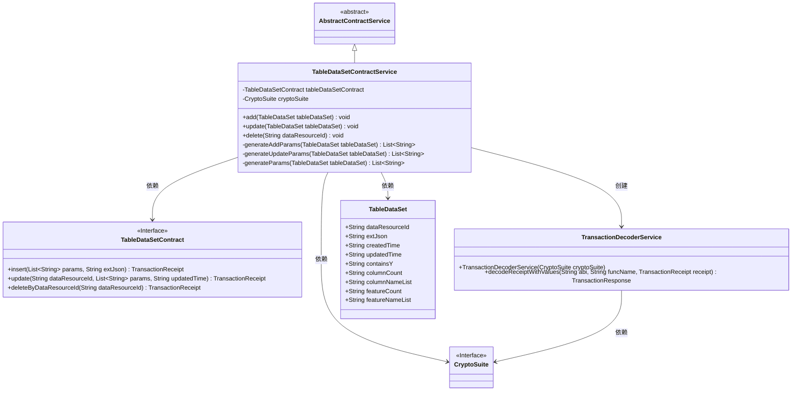
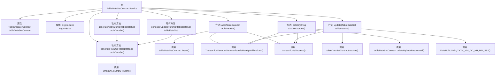

# 基础信息

|      |      |
|------|------|
| 名称 | TableDataSetContractService |
| 编码语言 | .java |
| 代码路径 | WeFe/union/union-service/src/main/java/com/welab/wefe/union/service/service/contract/TableDataSetContractService.java |
| 包名 | com.welab.wefe.union.service.service.contract |
| 依赖项 | ['com.welab.wefe.common.StatusCode', 'com.welab.wefe.common.data.mongodb.entity.union.TableDataSet', 'com.welab.wefe.common.exception.StatusCodeWithException', 'com.welab.wefe.common.util.DateUtil', 'com.welab.wefe.common.util.JObject', 'com.welab.wefe.common.util.StringUtil', 'com.welab.wefe.union.service.contract.TableDataSetContract', 'org.fisco.bcos.sdk.crypto.CryptoSuite', 'org.fisco.bcos.sdk.model.TransactionReceipt', 'org.fisco.bcos.sdk.transaction.codec.decode.TransactionDecoderService', 'org.fisco.bcos.sdk.transaction.model.dto.TransactionResponse', 'org.springframework.beans.factory.annotation.Autowired', 'org.springframework.stereotype.Service', 'java.util.ArrayList', 'java.util.Date', 'java.util.List'] |
| 概述说明 | TableDataSetContractService提供数据集的增删改功能，通过智能合约操作，处理事务回执并校验结果，异常时抛出系统错误。 |

# 说明

TableDataSetContractService是一个继承自AbstractContractService的服务类，用于管理TableDataSet的增删改操作。它通过注入的TableDataSetContract和CryptoSuite与区块链交互。add方法用于添加新的TableDataSet，生成参数并调用合约的insert方法，处理交易回执并检查结果。update方法更新现有TableDataSet，生成参数并调用合约的update方法，同样处理交易回执。delete方法通过dataResourceId删除记录，调用合约的deleteByDataResourceId方法。私有方法generateAddParams和generateUpdateParams用于生成合约调用所需的参数列表，包含数据资源ID、特征信息及时间戳等。所有操作均捕获异常并抛出StatusCodeWithException。

# 类列表 Class Summary

| 名称   | 类型  | 说明 |
|-------|------|-------------|
| TableDataSetContractService | class | TableDataSetContractService提供表数据集的增删改功能，通过智能合约操作数据，处理交易回执并检查结果，异常时抛出系统错误。 |

## 类 TableDataSetContractService

|      |      |
|------|------|
| 访问范围 | @Service;public |
| 类型 | class |
| 名称 | TableDataSetContractService |
| 说明 | TableDataSetContractService提供表数据集的增删改功能，通过智能合约操作数据，处理交易回执并检查结果，异常时抛出系统错误。 |

### UML类图

这段代码展示了一个基于区块链的表格数据服务系统，核心类TableDataSetContractService继承自抽象服务类，通过智能合约接口操作数据。系统主要功能包括添加、更新和删除表格数据集，使用加密套件进行交易解码，并通过参数生成器构建交易参数。类图清晰地呈现了服务层与合约接口、加密组件、数据模型之间的依赖关系，以及交易解码服务的创建过程。所有操作均包含异常处理机制，确保系统稳定性。

### 内部方法调用关系图

这段代码是TableDataSetContractService类的实现，继承自AbstractContractService。主要功能包括添加(add)、更新(update)和删除(delete)TableDataSet数据，通过调用tableDataSetContract的方法与区块链交互。每个操作都会生成交易收据，并通过TransactionDecoderService解码收据，最后检查交易是否成功。私有方法generateAddParams、generateUpdateParams和generateParams用于生成不同操作所需的参数列表。代码中使用了日期格式化和字符串空值处理等工具方法。

### 字段列表 Field List

| 名称  | 类型  | 说明 |
|-------|-------|------|
| tableDataSetContract | TableDataSetContract | 代码片段使用@Autowired注解自动注入TableDataSetContract类型的私有变量tableDataSetContract。 |
| cryptoSuite | CryptoSuite | 自动注入加密工具组件。 |

### 方法列表

| 名称  | 类型  | 说明 |
|-------|-------|------|
| generateAddParams | List<String> | 生成添加参数列表方法：接收表数据集，返回包含数据资源ID、生成参数、创建和更新时间的有序列表。 |
| add | void | 方法`add`用于添加表数据，调用合约插入数据并处理交易回执，失败时抛出异常。 |
| generateParams | List<String> | 生成参数列表方法，从TableDataSet提取五个字段值，空值转为空字符串后存入列表返回。 |
| generateUpdateParams | List<String> | 生成更新参数列表，调用通用参数生成方法处理表数据集。 |
| update | void | 更新TableDataSet数据，生成参数并调用合约更新，处理交易回执，失败抛出异常。 |
| delete | void | 该方法通过区块链智能合约删除指定数据资源ID的记录，处理交易回执并检查结果，失败时抛出异常。 |

