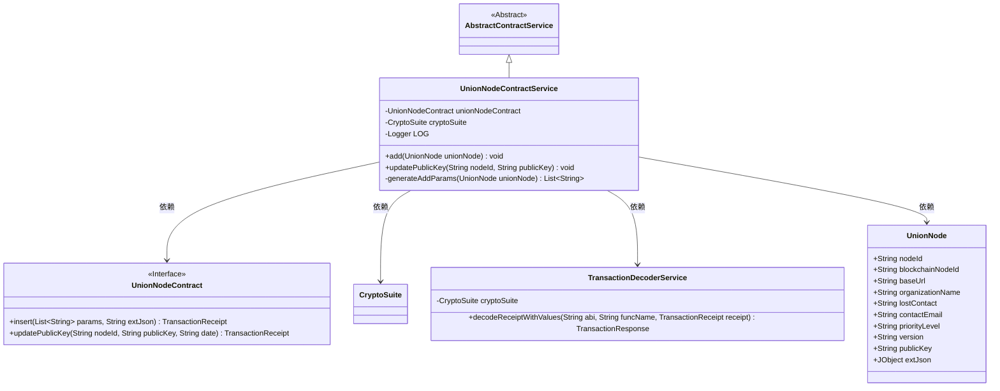
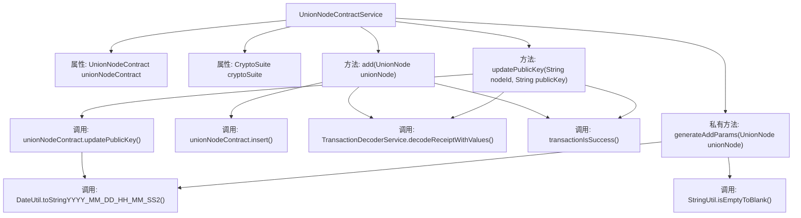

# 基础信息

|      |      |
|------|------|
| 名称 | UnionNodeContractService |
| 编码语言 | .java |
| 代码路径 | WeFe/union/union-service/src/main/java/com/welab/wefe/union/service/service/contract/UnionNodeContractService.java |
| 包名 | com.welab.wefe.union.service.service.contract |
| 依赖项 | ['com.welab.wefe.common.StatusCode', 'com.welab.wefe.common.data.mongodb.entity.union.UnionNode', 'com.welab.wefe.common.exception.StatusCodeWithException', 'com.welab.wefe.common.util.DateUtil', 'com.welab.wefe.common.util.JObject', 'com.welab.wefe.common.util.StringUtil', 'com.welab.wefe.union.service.contract.UnionNodeContract', 'org.fisco.bcos.sdk.crypto.CryptoSuite', 'org.fisco.bcos.sdk.model.TransactionReceipt', 'org.fisco.bcos.sdk.transaction.codec.decode.TransactionDecoderService', 'org.fisco.bcos.sdk.transaction.model.dto.TransactionResponse', 'org.slf4j.Logger', 'org.slf4j.LoggerFactory', 'org.springframework.beans.factory.annotation.Autowired', 'org.springframework.stereotype.Service', 'java.util.ArrayList', 'java.util.Date', 'java.util.List'] |
| 概述说明 | UnionNodeContractService提供添加UnionNode和更新公钥功能，处理交易回执并记录日志，异常时抛出StatusCodeWithException。 |

# 说明

UnionNodeContractService是一个服务类，继承自AbstractContractService，用于管理UnionNode合约操作。包含两个主要方法：add用于添加UnionNode节点，处理交易收据并记录日志；updatePublicKey用于更新节点公钥，同样处理交易并验证结果。两个方法均捕获异常并抛出StatusCodeWithException。私有方法generateAddParams生成添加节点所需的参数列表，包含节点ID、URL、组织名称等字段。类中注入了UnionNodeContract合约实例和CryptoSuite加密工具。

# 类列表 Class Summary

| 名称   | 类型  | 说明 |
|-------|------|-------------|
| UnionNodeContractService | class | UnionNodeContractService提供添加和更新UnionNode的功能，包括节点插入和公钥更新，处理交易回执并记录日志，异常时抛出状态码异常。 |

## 类 UnionNodeContractService

|      |      |
|------|------|
| 访问范围 | @Service;public |
| 类型 | class |
| 名称 | UnionNodeContractService |
| 说明 | UnionNodeContractService提供添加和更新UnionNode的功能，包括节点插入和公钥更新，处理交易回执并记录日志，异常时抛出状态码异常。 |

### UML类图

类图描述：UnionNodeContractService继承自AbstractContractService，负责处理UnionNode的添加和公钥更新操作。它依赖UnionNodeContract接口执行区块链交易，使用CryptoSuite进行加密操作，并通过TransactionDecoderService解析交易回执。UnionNode类存储节点信息，generateAddParams方法用于生成交易参数。服务类通过日志记录操作结果，并处理各种异常情况。

### 内部方法调用关系图

这段代码是UnionNodeContractService类的实现，继承自AbstractContractService，主要用于处理联盟节点的合约操作。包含两个主要方法：add()用于添加联盟节点，updatePublicKey()用于更新节点公钥，以及一个私有方法generateAddParams()用于生成添加节点所需的参数列表。方法中涉及区块链交易发送、回执解码、日志记录和参数校验等操作，通过异常处理确保业务逻辑的健壮性。

### 字段列表 Field List

| 名称  | 类型  | 说明 |
|-------|-------|------|
| LOG = LoggerFactory.getLogger(UnionNodeContractService.class) | Logger | 定义UnionNodeContractService类的私有静态日志对象LOG。 |
| unionNodeContract | UnionNodeContract | 自动注入UnionNodeContract实例。 |
| cryptoSuite | CryptoSuite | 自动注入加密套件实例。 |

### 方法列表

| 名称  | 类型  | 说明 |
|-------|-------|------|
| add | void | 方法add用于向UnionNode合约插入节点数据，处理交易响应并记录日志，捕获异常时抛出StatusCodeWithException或系统错误。 |
| updatePublicKey | void | 方法updatePublicKey用于更新节点公钥，发送交易并解析回执，处理成功或异常情况，记录日志。 |
| generateAddParams | List<String> | 生成UnionNode参数列表，包含节点ID、区块链节点ID、基础URL、组织名称、联系方式、优先级、版本、公钥及当前时间戳。 |

