# 基础信息

|      |      |
|------|------|
| 名称 | contract |
| 编码语言 | .java |
| 代码路径 | WeFe/union/union-service/src/main/java/com/welab/wefe/union/service/service/contract |
| 包名 | docs.union.union-service.src.main.java.com.welab.wefe.union.service.service.contract |
| 概述说明 | 多个服务类继承AbstractContractService，处理区块链交易。功能包括成员文件管理、布隆过滤器操作、数据资源增删改查、数据集权限管理、节点管理等。各服务类通过智能合约交互，包含参数生成、交易回执处理和异常捕获。 |

# 说明

## 概述  
该模块是区块链数据管理服务集合，核心职责为通过智能合约实现各类数据资源的增删改查及权限管理，类似数据库中间件。接口规范统一采用交易回执解析、参数生成模板和异常状态码处理，例如通过AbstractContractService派生的transactionIsSuccess方法校验结果。关键数据结构包括DataResource（含ID/成员ID/描述）、BloomFilter（含哈希函数/时间戳）和Member（含公钥/活动时间）。外部依赖项包括CryptoSuite加密组件、TransactionDecoderService和MongoDB存储。例如MemberContractService使用MongoDB存储成员扩展信息。

## 主要业务场景  
模块支持联邦学习场景下的多方数据协同管理，典型流程为：1)成员注册时通过MemberContractService校验身份；2)DataSetContractService上传数据集并设置权限；3)DataResourceContractService管理资源元数据。交互模式采用"本地校验+链上操作"双阶段，例如DataSetMemberPermissionContractService先本地验证成员ID再提交链上交易。功能完整性体现在覆盖数据全生命周期（如ImageDataSetContractService处理图像数据增删改）和细粒度控制（如布隆过滤器更新）。API类型包含CRUD基础操作和扩展功能（如UnionNodeContractService的节点公钥更新），集成案例包括成员服务与数据资源联动。

### 包内部结构视图

```mermaid
graph TD
    contract --> MemberFileInfoContractService.java
    contract --> BloomFilterContractService.java
    contract --> DataResourceContractService.java
    contract --> DataSetContractService.java
    contract --> AbstractContractService.java
    contract --> ImageDataSetContractService.java
    contract --> MemberServiceContractService.java
    contract --> DataSetMemberPermissionContractService.java
    contract --> TableDataSetContractService.java
    contract --> UnionNodeContractService.java
    contract --> MemberContractService.java
```

该流程图展示了contract目录下的11个服务类文件结构。所有Java文件均为contract的直接子节点，包括MemberFileInfoContractService、BloomFilterContractService等具体服务实现类以及AbstractContractService抽象基类，形成扁平化的服务契约层结构。

# 文件列表

| 名称   | 类型  | 说明 |
|-------|------|-------------|
| [MemberFileInfoContractService.java](MemberFileInfoContractService.md) | file | MemberFileInfoContractService类提供成员文件信息操作，包括添加文件和检查文件是否存在。添加文件时生成参数并发送交易，检查存在性通过合约查询实现。异常处理记录日志并抛出状态码异常。 |
| [BloomFilterContractService.java](BloomFilterContractService.md) | file | BloomFilterContractService提供添加、更新和删除布隆过滤器的功能，通过智能合约操作并验证交易结果，异常时抛出错误。 |
| [DataResourceContractService.java](DataResourceContractService.md) | file | DataResourceContractService提供数据资源的增删改功能，通过智能合约操作并验证交易结果，处理异常情况。 |
| [DataSetContractService.java](DataSetContractService.md) | file | 数据集服务类，提供增删改查功能，处理数据集插入、更新、删除及懒更新操作，依赖多个Mongo存储库和智能合约交互。 |
| [AbstractContractService.java](AbstractContractService.md) | file | AbstractContractService类提供交易状态检查方法，处理不同返回码（0成功，-1数据存在，-2失败，-3数据不存在），包含异常判断及数据存在性验证。 |
| [ImageDataSetContractService.java](ImageDataSetContractService.md) | file | ImageDataSetContractService提供图片数据集增删改功能，通过智能合约操作数据，处理交易回执并校验结果，异常时抛出错误。 |
| [MemberServiceContractService.java](MemberServiceContractService.md) | file | MemberServiceContractService类提供会员服务的增删改查功能，包括保存、更新、检查存在性、更新扩展JSON和删除操作，处理交易响应并记录日志。 |
| [DataSetMemberPermissionContractService.java](DataSetMemberPermissionContractService.md) | file | 数据集成员权限服务类，提供保存和删除权限功能。保存时验证成员ID有效性，删除旧权限后插入新权限。异常时抛出状态码错误。 |
| [TableDataSetContractService.java](TableDataSetContractService.md) | file | TableDataSetContractService提供数据集的增删改功能，通过智能合约操作，处理事务回执并校验结果，异常时抛出系统错误。 |
| [UnionNodeContractService.java](UnionNodeContractService.md) | file | UnionNodeContractService提供添加UnionNode和更新公钥功能，处理交易回执并记录日志，异常时抛出StatusCodeWithException。 |
| [MemberContractService.java](MemberContractService.md) | file | MemberContractService提供成员管理功能，包括添加、更新、查询成员信息，处理区块链交易并校验结果。支持更新成员logo、公钥、活动时间等属性，通过事务确保数据一致性。 |

