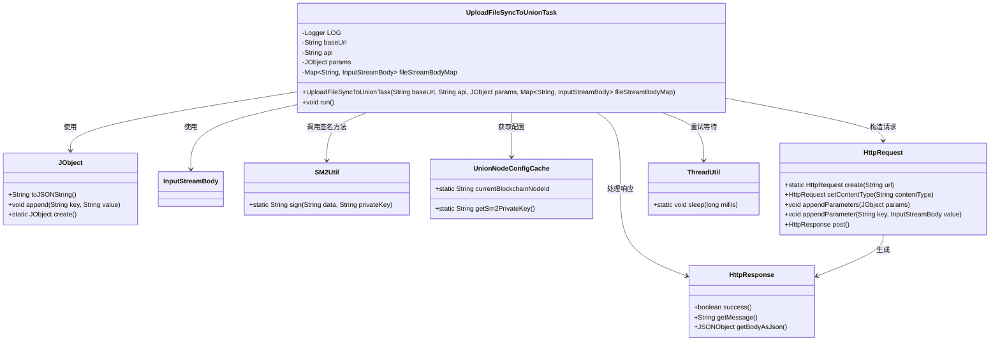
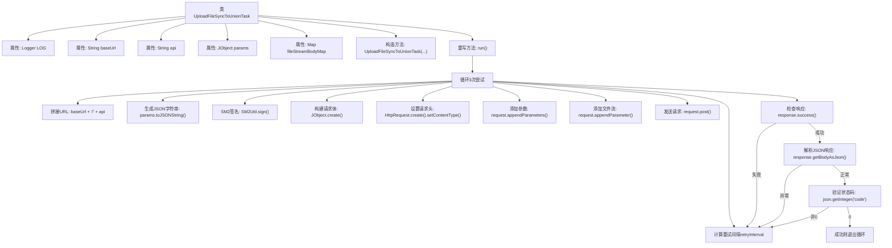

# 基础信息

|      |      |
|------|------|
| 名称 | UploadFileSyncToUnionTask |
| 编码语言 | .java |
| 代码路径 | WeFe/union/union-service/src/main/java/com/welab/wefe/union/service/task/UploadFileSyncToUnionTask.java |
| 包名 | com.welab.wefe.union.service.task |
| 依赖项 | ['com.alibaba.fastjson.JSONException', 'com.alibaba.fastjson.JSONObject', 'com.welab.wefe.common.http.HttpContentType', 'com.welab.wefe.common.http.HttpRequest', 'com.welab.wefe.common.http.HttpResponse', 'com.welab.wefe.common.util.JObject', 'com.welab.wefe.common.util.SM2Util', 'com.welab.wefe.common.util.StringUtil', 'com.welab.wefe.common.util.ThreadUtil', 'com.welab.wefe.union.service.cache.UnionNodeConfigCache', 'org.apache.http.entity.ContentType', 'org.apache.http.entity.mime.content.InputStreamBody', 'org.slf4j.Logger', 'org.slf4j.LoggerFactory', 'org.springframework.util.MultiValueMap', 'org.springframework.web.multipart.MultipartFile', 'java.io.IOException', 'java.util.Map'] |
| 概述说明 | UploadFileSyncToUnionTask是线程类，用于上传文件到联盟节点。包含重试机制，每次请求间隔递增。使用SM2签名，支持多部分表单数据上传，验证响应状态码和JSON结果。失败时记录错误并重试。 |

# 说明

UploadFileSyncToUnionTask是一个继承Thread的类，用于同步上传文件到联盟节点。它包含baseUrl、api、params和fileStreamBodyMap等属性，通过构造函数初始化。在run方法中，任务会尝试最多3次上传操作，每次失败后等待递增的间隔时间。上传过程包括生成SM2签名、构建包含数据和签名的请求体、设置multipart内容类型、添加文件流参数，并发送POST请求。若响应失败或返回码非0，会记录错误并重试；成功则终止循环。整个过程通过日志记录错误信息。

# 类列表 Class Summary

| 名称   | 类型  | 说明 |
|-------|------|-------------|
| UploadFileSyncToUnionTask | class | 上传文件同步任务类，包含重试机制，使用SM2签名，发送多部分HTTP请求，处理响应和错误。 |

## 类 UploadFileSyncToUnionTask

|      |      |
|------|------|
| 访问范围 | public |
| 类型 | class |
| 名称 | UploadFileSyncToUnionTask |
| 说明 | 上传文件同步任务类，包含重试机制，使用SM2签名，发送多部分HTTP请求，处理响应和错误。 |

### UML类图

类图描述：该图展示了UploadFileSyncToUnionTask线程类的结构及其依赖关系。该类负责文件同步上传任务，包含基础URL、API路径、参数和文件流等私有成员。通过SM2Util进行数据签名，使用HttpRequest构建多部分请求，并处理HttpResponse结果。依赖JObject处理JSON数据，通过UnionNodeConfigCache获取配置信息，利用ThreadUtil实现重试机制。整体呈现了文件上传任务的核心协作关系。

### 内部方法调用关系图

这段代码实现了一个多线程文件上传任务，通过3次重试机制将文件同步到联盟节点。流程包括：初始化请求参数、生成SM2签名、构建多部分表单请求、添加文件流、发送POST请求，并对响应进行多层校验（网络状态、JSON解析、业务状态码）。每次失败后会按递增间隔（300*i毫秒）休眠后重试，直到成功或达到最大重试次数。

### 字段列表 Field List

| 名称  | 类型  | 说明 |
|-------|-------|------|
| fileStreamBodyMap | Map<String, InputStreamBody> | 定义了一个私有Map变量fileStreamBodyMap，键为String类型，值为InputStreamBody类型。 |
| api | String | 声明一个私有字符串变量api。 |
| baseUrl | String | 声明一个私有字符串变量baseUrl。 |
| LOG = LoggerFactory.getLogger(this.getClass()) | Logger | 定义当前类的日志记录器实例，用于输出日志信息。 |
| params | JObject | 私有JObject类型参数params。 |

### 方法列表

| 名称  | 类型  | 说明 |
|-------|-------|------|
| run | void | 代码实现重试机制，循环3次发送HTTP请求。每次生成签名，构建请求体并上传文件流。失败时记录错误并延迟重试，成功或达到重试次数后结束。 |

