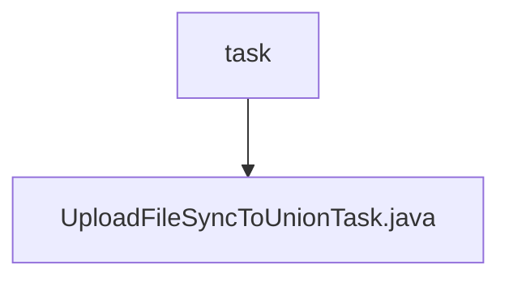

# 基础信息

|      |      |
|------|------|
| 名称 | task |
| 编码语言 | .java |
| 代码路径 | WeFe/union/union-service/src/main/java/com/welab/wefe/union/service/task |
| 包名 | docs.union.union-service.src.main.java.com.welab.wefe.union.service.task |
| 概述说明 | UploadFileSyncToUnionTask是线程类，用于上传文件到联盟节点。包含重试机制，每次请求间隔递增。使用SM2签名，支持多部分表单数据上传，验证响应状态码和JSON结果。失败时记录错误并重试。 |

# 说明

UploadFileSyncToUnionTask是一个继承Thread的类，用于同步上传文件到联盟节点。它包含baseUrl、api、params和fileStreamBodyMap等属性，通过构造函数初始化。在run方法中，任务会尝试最多3次上传操作，每次失败后等待递增的间隔时间。上传过程包括生成SM2签名、构建包含数据和签名的请求体、设置multipart内容类型、添加文件流参数，并发送POST请求。若响应失败或返回码非0，会记录错误并重试；成功则终止循环。整个过程通过日志记录错误信息。

### 包内部结构视图

该流程图展示了WeFe项目中union-service模块的任务目录结构。根节点"task"表示任务包路径，其下级节点是具体的任务实现文件"UploadFileSyncToUnionTask.java"。这个结构清晰地反映了任务处理模块的单一文件组织结构，符合常见的Java项目任务处理类存放规范。

# 文件列表

| 名称   | 类型  | 说明 |
|-------|------|-------------|
| [UploadFileSyncToUnionTask.java](UploadFileSyncToUnionTask.md) | file | UploadFileSyncToUnionTask是线程类，用于上传文件到联盟节点。包含重试机制，每次请求间隔递增。使用SM2签名，支持多部分表单数据上传，验证响应状态码和JSON结果。失败时记录错误并重试。 |

