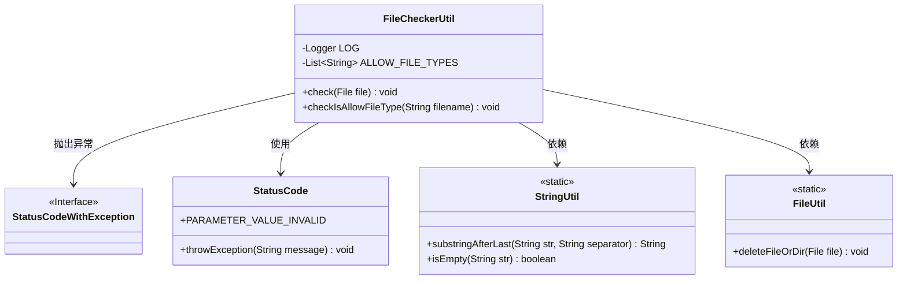
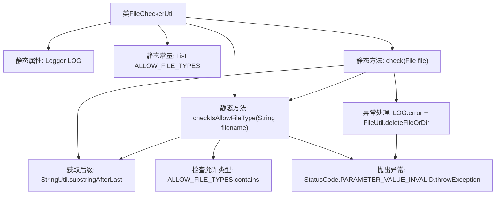
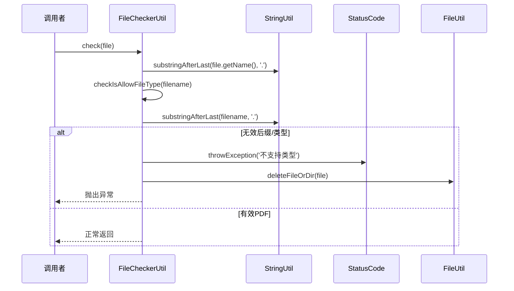

# 基础信息

|      |      |
|------|------|
| 名称 | FileCheckerUtil |
| 编码语言 | .java |
| 代码路径 | WeFe/union/union-service/src/main/java/com/welab/wefe/union/service/util/FileCheckerUtil.java |
| 包名 | com.welab.wefe.union.service.util |
| 依赖项 | ['com.welab.wefe.common.StatusCode', 'com.welab.wefe.common.exception.StatusCodeWithException', 'com.welab.wefe.common.util.FileUtil', 'com.welab.wefe.common.util.StringUtil', 'org.slf4j.Logger', 'org.slf4j.LoggerFactory', 'java.io.File', 'java.util.Arrays', 'java.util.List'] |
| 概述说明 | FileCheckerUtil类用于检查文件类型，支持pdf、jpg、png、jpeg，不合法则删除文件并抛出异常。 |

# 说明

FileCheckerUtil是一个用于文件类型检查的工具类。它定义了允许的文件类型列表（pdf、jpg、png、jpeg），提供了两个静态方法：check方法用于检查文件安全性，会验证文件类型并在失败时删除文件；checkIsAllowFileType方法专门验证文件名后缀是否合法，会检查文件名非空、存在后缀且属于允许类型。两种方法在验证失败时都会抛出异常并记录错误日志。

# 类列表 Class Summary

| 名称   | 类型  | 说明 |
|-------|------|-------------|
| FileCheckerUtil | class | FileCheckerUtil类用于检查文件类型，支持pdf、jpg、png、jpeg格式，验证失败时删除文件并抛出异常。 |

## 类 FileCheckerUtil

|      |      |
|------|------|
| 访问范围 | public |
| 类型 | class |
| 名称 | FileCheckerUtil |
| 说明 | FileCheckerUtil类用于检查文件类型，支持pdf、jpg、png、jpeg格式，验证失败时删除文件并抛出异常。 |

### UML类图

类图描述：
FileCheckerUtil是一个文件检查工具类，包含静态方法check和checkIsAllowFileType，用于验证文件类型是否合法。它依赖StringUtil进行字符串处理，StatusCode处理错误状态码，FileUtil进行文件删除操作，并在检查失败时抛出StatusCodeWithException异常。类中维护了一个允许文件类型的静态列表ALLOW_FILE_TYPES。

### 内部方法调用关系图

流程图描述：该流程图展示了FileCheckerUtil类的结构，包含日志记录器、允许文件类型列表和两个核心方法。check方法通过调用checkIsAllowFileType验证文件后缀，若类型不匹配则删除文件并抛异常。时序图详细描述了文件检查流程，包括后缀提取、类型验证和异常处理路径，特别突出了对PDF文件的特殊处理和其他类型的错误处理机制。

### 字段列表 Field List

| 名称  | 类型  | 说明 |
|-------|-------|------|
| LOG = LoggerFactory.getLogger(FileCheckerUtil.class) | Logger | 定义FileCheckerUtil类的静态日志记录器实例。 |
| ALLOW_FILE_TYPES = Arrays.asList(            "pdf","jpg","png","jpeg"    ) | List<String> | 允许的文件类型列表：pdf、jpg、png、jpeg。 |

### 方法列表

| 名称  | 类型  | 说明 |
|-------|-------|------|
| check | void | 检查文件类型是否允许，仅支持PDF格式，否则抛出异常并删除文件。 |
| checkIsAllowFileType | void | 检查文件类型是否允许：文件名非空，必须有后缀且后缀在允许列表中，否则抛出异常。 |

