# 基础信息

|      |      |
|------|------|
| 名称 | MapperUtil |
| 编码语言 | .java |
| 代码路径 | WeFe/union/union-service/src/main/java/com/welab/wefe/union/service/util/MapperUtil.java |
| 包名 | com.welab.wefe.union.service.util |
| 依赖项 | ['com.welab.wefe.common.data.mongodb.dto.dataresource.DataResourceQueryInput', 'com.welab.wefe.common.data.mongodb.dto.dataresource.DataResourceQueryOutput', 'com.welab.wefe.common.data.mongodb.dto.dataset.DataSetQueryInput', 'com.welab.wefe.common.data.mongodb.dto.dataset.DataSetQueryOutput', 'com.welab.wefe.common.data.mongodb.dto.member.MemberServiceQueryOutput', 'com.welab.wefe.common.data.mongodb.entity.union.DataResource', 'com.welab.wefe.common.data.mongodb.entity.union.DataSet', 'com.welab.wefe.common.data.mongodb.entity.union.ImageDataSet', 'com.welab.wefe.common.data.mongodb.entity.union.Member', 'com.welab.wefe.common.util.DateUtil', 'com.welab.wefe.common.util.JObject', 'com.welab.wefe.common.util.StringUtil', 'com.welab.wefe.union.service.api.dataresource.dataset.image.PutApi', 'com.welab.wefe.union.service.api.dataresource.dataset.nomal.QueryApi', 'com.welab.wefe.union.service.dto.dataresource.ApiDataResourceQueryInput', 'com.welab.wefe.union.service.dto.dataresource.ApiDataResourceQueryOutput', 'com.welab.wefe.union.service.dto.dataresource.bloomfilter.ApiBloomFilterQueryOutput', 'com.welab.wefe.union.service.dto.dataresource.dataset.image.ApiImageDataSetQueryOutput', 'com.welab.wefe.union.service.dto.dataresource.dataset.table.ApiDataSetQueryOutput', 'com.welab.wefe.union.service.dto.dataresource.dataset.table.ApiTableDataSetQueryOutput', 'com.welab.wefe.union.service.dto.dataresource.dataset.table.DataSetDetailOutput', 'com.welab.wefe.union.service.dto.member.ApiMemberServiceQueryOutput', 'com.welab.wefe.union.service.dto.member.MemberQueryOutput', 'java.util.Date'] |
| 概述说明 | MapperUtil类提供多个静态方法，用于不同数据模型间的转换，包括时间格式处理和属性映射。主要功能包括数据资源、数据集和成员的输入输出转换，以及日期格式化。 |

# 说明

MapperUtil类提供了一系列静态方法，用于不同类型的数据转换和映射。主要包括将DataResourceQueryOutput转换为不同API输出对象（如ApiBloomFilterQueryOutput、ApiImageDataSetQueryOutput等），处理时间格式转换，以及成员、数据集等对象的映射。此外，还包含输入对象到数据资源的转换方法，如transferPutInputToDataResource。工具类还提供了字符串到日期的转换方法toDate，并在main方法中演示了日期格式的转换示例。

# 类列表 Class Summary

| 名称   | 类型  | 说明 |
|-------|------|-------------|
| MapperUtil | class | MapperUtil类提供数据转换功能，包括将DataResourceQueryOutput转换为不同类型输出、处理日期格式、成员和数据集转换等。 |


## 类 MapperUtil

|      |      |
|------|------|
| 访问范围 | public |
| 类型 | class |
| 名称 | MapperUtil |
| 说明 | MapperUtil类提供数据转换功能，包括将DataResourceQueryOutput转换为不同类型输出、处理日期格式、成员和数据集转换等。 |


### UML类图

```mermaid
classDiagram
    class MapperUtil {
        +ApiBloomFilterQueryOutput transferDetailBloomFilter(DataResourceQueryOutput dataResourceQueryOutput)
        +ApiImageDataSetQueryOutput transferDetailImageDataSet(DataResourceQueryOutput dataResourceQueryOutput)
        +ApiTableDataSetQueryOutput transferDetailTableDataSet(DataResourceQueryOutput dataResourceQueryOutput)
        +ApiDataResourceQueryOutput transferDetailDefault(DataResourceQueryOutput dataResourceQueryOutput)
        +DataResourceQueryInput transferDataResourceInput(ApiDataResourceQueryInput entity)
        +MemberQueryOutput transferMember(Member member)
        +DataSetDetailOutput transferDataSetDetail(DataSet dataSet)
        +ApiDataSetQueryOutput transferToDataSetOutput(DataSetQueryOutput entity)
        +DataSetQueryInput transferToDataSetInput(QueryApi$Input entity)
        +ApiMemberServiceQueryOutput transferToMemberServiceQueryOutput(MemberServiceQueryOutput memberServiceQueryOutput)
        +ImageDataSet transferPutInputToImageDataSet(PutApi$Input input)
        +DataResource transferPutInputToDataResource(PutApi$Input input)
        +Date toDate(String dateStr)
    }

    class DataResourceQueryOutput {
        // 数据资源查询输出基类
    }

    class ApiBloomFilterQueryOutput {
        // Bloom过滤器API输出
    }

    class ApiImageDataSetQueryOutput {
        // 图像数据集API输出
    }

    class ApiTableDataSetQueryOutput {
        // 表格数据集API输出
    }

    class ApiDataResourceQueryOutput {
        // 数据资源API输出
    }

    class DataResourceQueryInput {
        // 数据资源查询输入
    }

    class Member {
        // 成员实体
    }

    class MemberQueryOutput {
        // 成员查询输出
    }

    class DataSet {
        // 数据集实体
    }

    class DataSetDetailOutput {
        // 数据集详情输出
    }

    class DataSetQueryOutput {
        // 数据集查询输出
    }

    class ApiDataSetQueryOutput {
        // 数据集API输出
    }

    class QueryApi$Input {
        // 查询API输入
    }

    class DataSetQueryInput {
        // 数据集查询输入
    }

    class MemberServiceQueryOutput {
        // 成员服务查询输出
    }

    class ApiMemberServiceQueryOutput {
        // 成员服务API输出
    }

    class PutApi$Input {
        // 更新API输入
    }

    class ImageDataSet {
        // 图像数据集实体
    }

    class DataResource {
        // 数据资源实体
    }

    MapperUtil --> DataResourceQueryOutput : 转换
    MapperUtil --> ApiBloomFilterQueryOutput : 生成
    MapperUtil --> ApiImageDataSetQueryOutput : 生成
    MapperUtil --> ApiTableDataSetQueryOutput : 生成
    MapperUtil --> ApiDataResourceQueryOutput : 生成
    MapperUtil --> DataResourceQueryInput : 转换
    MapperUtil --> Member : 转换
    MapperUtil --> MemberQueryOutput : 生成
    MapperUtil --> DataSet : 转换
    MapperUtil --> DataSetDetailOutput : 生成
    MapperUtil --> DataSetQueryOutput : 转换
    MapperUtil --> ApiDataSetQueryOutput : 生成
    MapperUtil --> QueryApi$Input : 转换
    MapperUtil --> DataSetQueryInput : 生成
    MapperUtil --> MemberServiceQueryOutput : 转换
    MapperUtil --> ApiMemberServiceQueryOutput : 生成
    MapperUtil --> PutApi$Input : 转换
    MapperUtil --> ImageDataSet : 生成
    MapperUtil --> DataResource : 生成
```

这段类图展示了MapperUtil工具类与多个数据转换类之间的关系。MapperUtil作为核心转换器，包含12个静态方法，负责在不同数据类型之间进行转换和映射，主要涉及数据资源、数据集、成员服务等领域的对象转换。通过ModelMapper实现对象属性拷贝，并处理时间格式转换、空值判断等边缘情况，最终生成符合API规范的输出对象。各类之间的箭头清晰地表明了数据流动方向。


### 内部方法调用关系图

```mermaid
graph TD
    A["类MapperUtil"]
    B["方法: transferDetailBloomFilter"]
    C["方法: transferDetailImageDataSet"]
    D["方法: transferDetailTableDataSet"]
    E["方法: transferDetailDefault"]
    F["方法: transferDataResourceInput"]
    G["方法: transferMember"]
    H["方法: transferDataSetDetail"]
    I["方法: transferToDataSetOutput"]
    J["方法: transferToDataSetInput"]
    K["方法: transferToMemberServiceQueryOutput"]
    L["方法: transferPutInputToImageDataSet"]
    M["方法: transferPutInputToDataResource"]
    N["方法: toDate"]
    O["方法: main"]

    A --> B
    A --> C
    A --> D
    A --> E
    A --> F
    A --> G
    A --> H
    A --> I
    A --> J
    A --> K
    A --> L
    A --> M
    A --> N
    A --> O
```



这段代码定义了一个名为`MapperUtil`的工具类，主要用于不同类型数据之间的转换和映射。类中包含多个静态方法，如`transferDetailBloomFilter`、`transferDetailImageDataSet`等，用于将输入对象转换为不同类型的输出对象。此外，还包含辅助方法`toDate`用于日期格式转换，以及一个`main`方法用于测试日期转换功能。每个转换方法通常使用`ModelMapper.map`进行基础属性映射，并处理额外的数据设置和日期转换。

### 字段列表 Field List

| 名称  | 类型  | 说明 |
|-------|-------|------|

### 方法列表

| 名称  | 类型  | 说明 |
|-------|-------|------|
| transferToDataSetInput | DataSetQueryInput | 将QueryApi.Input转换为DataSetQueryInput，设置数据集ID、页码和页大小，默认页码0，页大小10。 |
| transferPutInputToDataResource | DataResource | 将PutApi.Input转换为DataResource对象，设置memberId后返回。 |
| transferPutInputToImageDataSet | ImageDataSet | 将输入对象转换为ImageDataSet，设置标签完成状态为1或0，并添加当前时间作为创建和更新时间。 |
| transferDetailDefault | ApiDataResourceQueryOutput | 将DataResourceQueryOutput转换为ApiDataResourceQueryOutput，映射创建和更新时间后返回。 |
| main | void | Java代码示例：将字符串转换为Date对象，再格式化输出为相同格式的字符串。 |
| transferDataResourceInput | DataResourceQueryInput | 将ApiDataResourceQueryInput对象转换为DataResourceQueryInput对象并返回。 |
| toDate | Date | 将字符串转换为日期对象，若字符串为空则返回null，使用指定格式解析。 |
| transferToMemberServiceQueryOutput | ApiMemberServiceQueryOutput | 将MemberServiceQueryOutput转换为ApiMemberServiceQueryOutput，映射字段并格式化时间。 |
| transferDetailImageDataSet | ApiImageDataSetQueryOutput | 将DataResourceQueryOutput转换为ApiImageDataSetQueryOutput，映射字段并设置额外数据、创建和更新时间。 |
| transferToDataSetOutput | ApiDataSetQueryOutput | 将DataSetQueryOutput转换为ApiDataSetQueryOutput，映射字段并处理空值，设置ID、使用计数及时间。 |
| transferDataSetDetail | DataSetDetailOutput | 将DataSet对象转换为DataSetDetailOutput对象，映射ID、创建时间和更新时间。 |
| transferMember | MemberQueryOutput | 将Member对象转换为MemberQueryOutput对象，映射ID、创建时间和更新时间。 |
| transferDetailTableDataSet | ApiTableDataSetQueryOutput | 将DataResourceQueryOutput转换为ApiTableDataSetQueryOutput，映射数据并设置额外信息、创建和更新时间。 |
| transferDetailBloomFilter | ApiBloomFilterQueryOutput | 将DataResourceQueryOutput转换为ApiBloomFilterQueryOutput，映射基础数据，设置额外数据、创建和更新时间。 |


