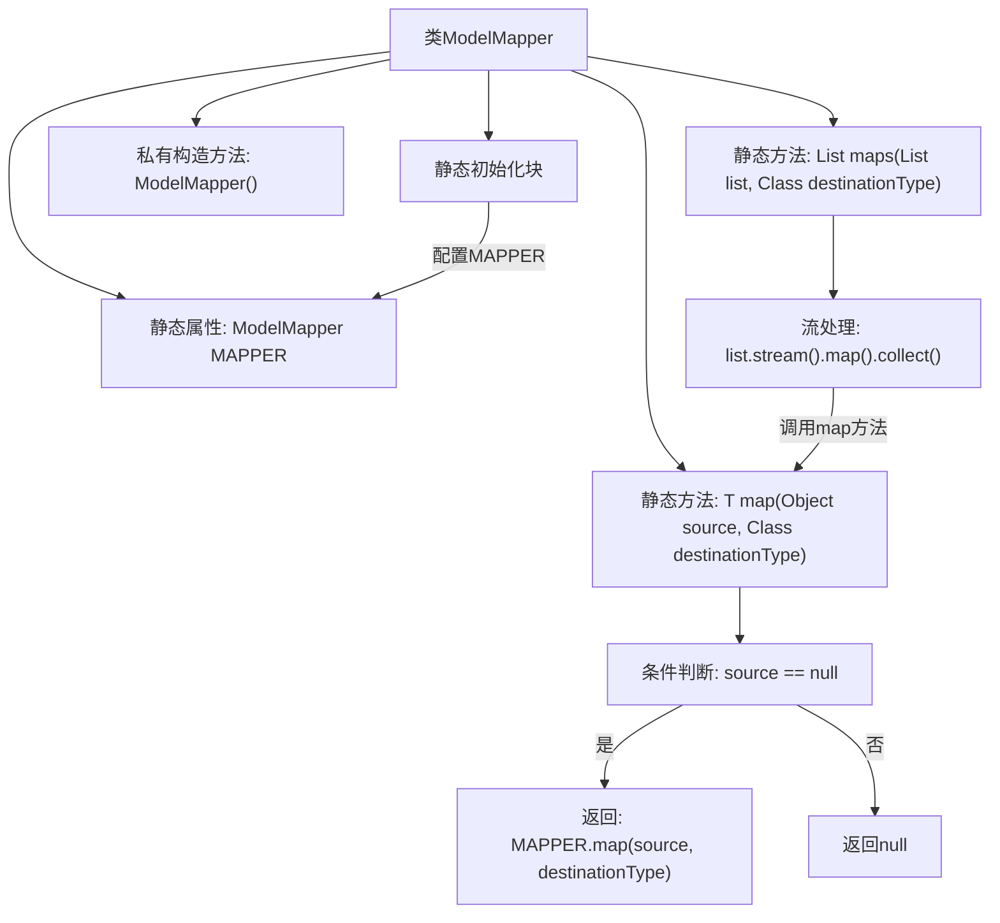

# 基础信息

|      |      |
|------|------|
| 名称 | ModelMapper |
| 编码语言 | .java |
| 代码路径 | WeFe/union/union-service/src/main/java/com/welab/wefe/union/service/util/ModelMapper.java |
| 包名 | com.welab.wefe.union.service.util |
| 依赖项 | ['org.modelmapper.config.Configuration', 'org.modelmapper.convention.MatchingStrategies', 'java.util.List', 'java.util.stream.Collectors'] |
| 概述说明 | ModelMapper工具类，线程安全，配置严格匹配和公开方法访问，提供对象和列表的映射功能。 |

# 说明

该代码定义了一个名为ModelMapper的工具类，用于对象映射转换。类中包含一个静态的ModelMapper实例，配置为严格匹配策略和仅允许公共方法访问。提供了两个静态方法：map方法用于单个对象转换，处理空值情况；maps方法用于列表批量转换，内部调用map方法并通过流处理实现。整个类设计为线程安全且不可实例化。

# 类列表 Class Summary

| 名称   | 类型  | 说明 |
|-------|------|-------------|
| ModelMapper | class | ModelMapper工具类，线程安全，静态初始化配置严格匹配和公开方法访问，提供对象和列表的映射方法，空源返回null。 |


## 类 ModelMapper

|      |      |
|------|------|
| 访问范围 | public |
| 类型 | class |
| 名称 | ModelMapper |
| 说明 | ModelMapper工具类，线程安全，静态初始化配置严格匹配和公开方法访问，提供对象和列表的映射方法，空源返回null。 |


### UML类图

```mermaid
classDiagram
    class ModelMapper {
        -org.modelmapper.ModelMapper MAPPER
        +map(Object source, Class~T~ destinationType) T
        +maps(List~?~ list, Class~T~ destinationType) List~T~
        -ModelMapper()
    }
    class org..modelmapper..ModelMapper {
        <<Interface>>
        +getConfiguration() Configuration
    }
    class Configuration {
        <<Interface>>
        +setMatchingStrategy(MatchingStrategies strategy)
        +setMethodAccessLevel(AccessLevel level)
    }
    class MatchingStrategies {
        <<Enumeration>>
        STRICT
        STANDARD
        LOOSE
    }
    class AccessLevel {
        <<Enumeration>>
        PUBLIC
        PROTECTED
        PRIVATE
    }

    ModelMapper --> org..modelmapper..ModelMapper : 依赖
    org..modelmapper..ModelMapper --> Configuration : 依赖
    Configuration --> MatchingStrategies : 依赖
    Configuration --> AccessLevel : 依赖
```

类图描述：
ModelMapper类是一个工具类，用于对象之间的映射转换。它包含一个静态的ModelMapper实例MAPPER，并通过静态初始化块配置了严格的匹配策略和公共方法访问级别。提供了两个泛型方法：map用于单个对象映射，maps用于列表对象映射。该类依赖于org.modelmapper.ModelMapper接口及其配置类Configuration，而Configuration又依赖于枚举类MatchingStrategies和AccessLevel来设置映射策略和访问级别。


### 内部方法调用关系图



该流程图展示了ModelMapper类的核心结构和调用关系。类包含静态MAPPER实例和两个核心映射方法：map处理单个对象转换，maps处理集合转换。静态初始化块配置MAPPER的严格匹配策略和公共方法访问级别。map方法包含空值检查逻辑，maps方法通过流式处理调用map方法完成批量转换。整个设计体现了线程安全和简洁的API风格。

### 字段列表 Field List

| 名称  | 类型  | 说明 |
|-------|-------|------|
| MAPPER = new org.modelmapper.ModelMapper() | org.modelmapper.ModelMapper | 私有静态常量MAPPER，使用ModelMapper类实例化。 |

### 方法列表

| 名称  | 类型  | 说明 |
|-------|-------|------|
| map | T | 静态方法将源对象映射为目标类型对象，若源对象为空则返回空，否则调用映射器转换。 |
| maps | List<T> | 将列表元素映射为目标类型并返回新列表。使用流处理逐个转换元素，最终收集为List。 |


