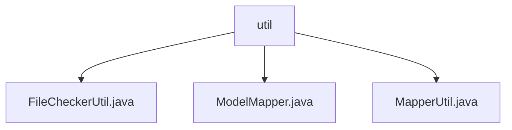

# 基础信息

|      |      |
|------|------|
| 名称 | util |
| 编码语言 | .java |
| 代码路径 | WeFe/union/union-service/src/main/java/com/welab/wefe/union/service/util |
| 包名 | docs.union.union-service.src.main.java.com.welab.wefe.union.service.util |
| 概述说明 | FileCheckerUtil检查文件类型和安全性，失败删除文件。ModelMapper提供线程安全对象映射，支持单对象和批量转换。MapperUtil处理数据转换，包括API输出、时间格式和对象映射。 |

# 说明

## 概述  
该模块提供文件校验、对象映射和数据转换三大核心功能。FileCheckerUtil负责文件类型安全验证，支持PDF/JPEG等格式；ModelMapper实现线程安全的单对象/批量对象转换；MapperUtil处理复杂数据结构映射，类似数据格式转换枢纽。关键数据结构包括文件类型白名单、DataResourceQueryOutput等传输对象。依赖项仅涉及ModelMapper库。例如FileCheckerUtil会删除非法文件，MapperUtil可转换BloomFilter查询结果。

## 主要业务场景  
模块适用于文件上传校验（如验证图片格式）、服务间对象转换（类似DTO映射）和跨系统数据适配（如API输出标准化）三大场景。交互模式均通过静态方法调用，例如ModelMapper.map()实现VO转换，MapperUtil处理时间格式统一化。典型应用包括安全文件处理流程（上传→校验→删除非法文件）和异构数据整合（原始数据→标准化API输出）。API类型涵盖校验类、转换类和适配器类。

### 包内部结构视图

该流程图展示了WeFe项目中union-service模块下util工具类的文件结构。根节点为util目录，包含三个工具类文件：FileCheckerUtil.java用于文件检查，ModelMapper.java处理模型映射，MapperUtil.java提供通用映射功能。所有文件均位于同一层级，没有嵌套关系。

# 文件列表

| 名称   | 类型  | 说明 |
|-------|------|-------------|
| [FileCheckerUtil.java](FileCheckerUtil.md) | file | FileCheckerUtil类用于检查文件类型，支持pdf、jpg、png、jpeg，不合法则删除文件并抛出异常。 |
| [ModelMapper.java](ModelMapper.md) | file | ModelMapper工具类，线程安全，配置严格匹配和公开方法访问，提供对象和列表的映射功能。 |
| [MapperUtil.java](MapperUtil.md) | file | MapperUtil类提供多个静态方法，用于不同数据模型间的转换，包括时间格式处理和属性映射。主要功能包括数据资源、数据集和成员的输入输出转换，以及日期格式化。 |

