# 系统架构

## 系统概览

本节概述了项目的核心功能、业务领域以及所采用的架构模式。

* **项目核心功能与业务领域：**  
  基于提供的配置文件和代码片段，该项目是一个**联邦学习平台**，专注于**隐私保护的分布式机器学习**。其核心功能包括：
  * 多方安全计算（MPC）和联邦学习算法支持
  * 数据资源管理（包括数据集、特征工程）
  * 模型训练、评估与部署
  * 区块链驱动的数据权限管理
  * 多角色协作（Promoter/Provider/Arbiter）
  * 异构计算资源调度（CPU/GPU）

  业务领域覆盖金融风控、医疗健康等需要数据协作但受隐私限制的场景。

* **架构模式：**  
  该系统采用**微服务架构**，关键依据包括：
  * `docker-compose.yml` 中明确定义了10+独立服务（如 `wefe_manager_service`、`wefe_python_service`、`wefe_gateway_service` 等）
  * 服务间通过 REST API（HTTP）和 gRPC（50051端口）通信
  * 各服务拥有独立的技术栈（Java/Spring Boot、Python/Flask、Vue.js）
  * 数据存储按服务隔离（MySQL、MongoDB、ClickHouse）
  * 共享配置通过 `config.properties` 和 `common.properties` 管理

## 核心组件与功能图谱

本节详细分解系统的主要组件及其职责，结合联邦学习领域特性进行架构补充。

* **流量入口层 (Traffic Entry Layer)：**
  * **组件与职责：**
    * **Nginx**：作为静态资源服务器托管前端（Vue.js构建的`board-website`/`fusion-website`等）
    * **API Gateway**（`wefe_gateway_service`）：统一处理 gRPC 请求路由、负载均衡、协议转换
    * **Kong/Spring Cloud Gateway**（推断）：基于行业实践，可能存在API网关层管理REST接口
  * **实现考量：**  
    采用容器化部署，Nginx 通过80端口暴露前端，Gateway 通过50051端口处理内部微服务通信。

* **应用服务层 (Application Service Layer)：**
  * **服务清单与核心功能：**

    | 服务名称                  | 主要职责                                                                 | 技术基座               |
    |---------------------------|--------------------------------------------------------------------------|------------------------|
    | `wefe_manager_service`     | 成员管理、权限控制、系统监控                                             | Java/Spring Boot       |
    | `wefe_board_service`      | 项目管理、任务调度、结果可视化                                           | Java/Spring Boot       |
    | `wefe_python_service`     | 核心算法执行（联邦学习训练/预测）                                        | Python/Flask, Spark 3.0|
    | `wefe_fusion_service`     | 数据融合（PSI、特征对齐）                                                | Java/Spring Boot       |
    | `wefe_union_service`       | 区块链成员认证、数据权限审计                                              | Java/Spring Boot, MongoDB|
    | `wefe_serving_service`    | 模型部署与推理服务                                                       | Java/Spring Boot       |
    | `wefe_blockchain_data_sync` | 区块链数据同步到传统数据库                                               | Java/Spring Boot       |

  * **技术选型意义：**
    * **Java服务**：选用Spring Boot处理高并发业务逻辑（如权限管理），利用JVM生态成熟度
    * **Python服务**：算法层使用Python+Spark，适配AI/ML生态（如PyTorch、TensorFlow）
    * **混合部署**：通过gRPC实现跨语言通信（Java↔Python）

  * **异步任务处理：**
    * **Spark集群**：`wefe_python_service`通过Spark分布式处理大规模数据训练
    * **Redis队列**（推断）：基于`wefe.service.cache.type=redis`配置，用于任务状态跟踪

* **数据管理层 (Data Management Layer)：**
  * **数据存储组件：**

    | 组件               | 数据类型                          | 职责                             | 选型考量                     |
    |--------------------|-----------------------------------|----------------------------------|------------------------------|
    | MySQL              | 业务元数据（成员、项目、任务）    | 事务型数据持久化                 | ACID支持，成熟生态           |
    | MongoDB            | 区块链操作日志、非结构化数据      | 高吞吐写入，灵活Schema          | 适合审计日志和文档存储       |
    | ClickHouse         | 模型指标、系统监控数据            | 实时分析                         | 列式存储，OLAP高效查询       |
    | Redis              | 会话缓存、任务状态                | 高速读写                         | 降低数据库压力               |
    | HDFS（推断）       | 分布式训练数据                   | 大规模数据集存储                 | 与Spark天然集成              |

## 容器配置概览

从Dockerfile和docker-compose中提取的关键部署配置：

| 服务名称 (Service Name)       | 容器镜像 (Container Image)          | 暴露端口 (Exposed Ports)       | 挂载卷 (Volumes)                                                                 | 关键环境变量 (Key Env Vars)                     |
|-------------------------------|-------------------------------------|--------------------------------|---------------------------------------------------------------------------------|-----------------------------------------------|
| `wefe_python_service`         | `wefe_python_service:v.2.1`         | 5000→8888                      | `/data/wefe_file_upload_dir`, `/opt/welab/wefe/config.properties`               | `PYTHONPATH=/opt/welab/wefe`                  |
| `wefe_gateway_service`        | `wefe_gateway_service:v.2.1`        | 50051                         | `/opt/gateway/config.properties`, `/data/logs/wefe-gateway`                     | `rpc.server.port=50051`                       |
| `wefe_manager_service`        | `wefe_manager_service:v.2.1`        | 8080→8800                     | `/data/logs/wefe-manager-service`, `/opt/service/application.properties`      | `server.port=8080`                            |
| `clickhouse`                  | `yandex/clickhouse-server:20.6.5.8` | 8122, 9900                    | `/var/lib/clickhouse`, `/etc/clickhouse-server/config.xml`                     | N/A                                           |

## 服务间协作与数据流转

* **核心通信路径：**
  1. **前端请求**：Vue.js → Nginx → Spring Boot服务（REST）
  2. **算法任务**：`board-service` → gRPC → `python_service` → Spark集群
  3. **数据融合**：`fusion-service` → 区块链合约 → `union-service`

* **交互协议：**
  * **RESTful HTTP**：前端与Java服务间通信（JSON格式）
  * **gRPC**：跨语言服务通信（如Java调用Python算法）
  * **消息队列**（推断）：基于Redis的任务状态通知

* **数据隔离策略：**
  * **微服务独立数据库**：各Java服务配置独立的MySQL schema（如`wefe_fusion`）
  * **区块链数据同步**：`blockchain-data-sync`将链上数据定期同步至MongoDB

## 整体架构概览图 (Mermaid)

```mermaid
graph TD
    A[用户] -- HTTPS --> B(Nginx)
    subgraph 流量入口层
        B -- API请求--> C[API Gateway]
        C -- gRPC --> D[Python服务]
    end
    subgraph 应用服务层
        D -- Spark任务 --> E[Spark Cluster]
        C -- REST --> F[Manager Service]
        F --> G[MySQL]
        C -- REST --> H[Fusion Service]
        H -- 智能合约 --> I[Union Service]
        I --> J[MongoDB]
    end
    subgraph 数据管理层
        E --> K[HDFS]
        F --> L[ClickHouse]
        I --> M[区块链节点]
    end
```



## 架构师核心洞察与未来展望

* **弹性扩展策略：**
  * **无状态服务**：Java微服务可通过K8s HPA水平扩展
  * **Spark动态分配**：`python_service`支持基于资源需求的Executor动态调整

* **安全体系：**
  * **区块链赋能**：`union-service`实现数据使用权与所有权的分离
  * **SM4加密**：敏感字段（如手机号）加密存储
  * **传输安全**：gRPC内置TLS支持（需补充证书配置）

* **性能优化方向：**
  * **缓存策略**：Redis缓存高频访问的模型参数
  * **GPU加速**：`wefe_python_gpu_service`支持CUDA加速训练

* **技术栈评估：**
  * **优势**：Java+Python混合栈平衡了工程稳定性和算法灵活性
  * **挑战**：Spark与K8s的深度集成需要进一步优化资源调度

* **未来演进：**
  * **服务网格**：引入Istio实现更细粒度的流量管理
  * **Serverless**：将批处理任务迁移至FC（Function Compute）
  * **跨云部署**：基于区块链构建跨云联邦学习网络

## 模块依赖关系图
该项目是一个基于Maven的多模块项目，包含多个子模块和复杂的内部依赖关系。以下是主要模块间的依赖关系。

```mermaid
graph TD
  wefe --> board
  wefe --> common
  wefe --> union
  wefe --> gateway
  wefe --> serving
  wefe --> fusion
  wefe --> mpc
  wefe --> manager
  
  board --> board-service
  board-service --> common-web
  board-service --> common-cert
  board-service --> common-data-storage
  board-service --> fusion-core
  
  manager --> manager-service
  manager-service --> common-web
  manager-service --> common-lang
  manager-service --> common-cert
  manager-service --> common-data-mongodb
  
  common --> java
  java --> common-lang
  java --> common-web
  java --> common-data-mysql
  java --> common-data-storage
  java --> common-proto
  java --> common-data-mongodb
  java --> common-wefe
  java --> common-verification-code
  java --> common-cert
  java --> common-jdbc
  
  common-web --> common-lang
  common-web --> common-data-mysql
  common-web --> common-wefe
  
  common-data-storage --> common-lang
  common-data-storage --> common-proto
  common-data-storage --> common-wefe
  
  common-wefe --> common-lang
  common-wefe --> common-verification-code
  
  serving --> serving-service
  serving --> serving-sdk-java
  serving-service --> common-lang
  serving-service --> common-web
  serving-service --> serving-sdk-java
  
  gateway --> common-data-mysql
  gateway --> common-lang
  gateway --> common-data-storage
  gateway --> common-wefe
  gateway --> common-cert
  
  mpc --> mpc-pir
  mpc --> mpc-common
  mpc --> mpc-psi
  mpc --> mpc-sa
  
  mpc-pir --> mpc-pir-server
  mpc-pir --> mpc-pir-sdk
  mpc-pir --> mpc-common
  
  mpc-psi --> mpc-psi-sdk
  mpc-psi --> mpc-common
  
  mpc-sa --> mpc-sa-server
  mpc-sa --> mpc-sa-sdk
  mpc-sa --> mpc-common
  
  union --> union-service
  union --> blockchain-data-sync
  union-service --> common-web
  union-service --> common-lang
  union-service --> common-data-mongodb
  
  blockchain-data-sync --> common-web
  blockchain-data-sync --> common-lang
  blockchain-data-sync --> common-data-mongodb
  
  fusion --> fusion-service
  fusion --> fusion-core
  fusion-service --> common-lang
  fusion-service --> common-web
  fusion-service --> fusion-core

